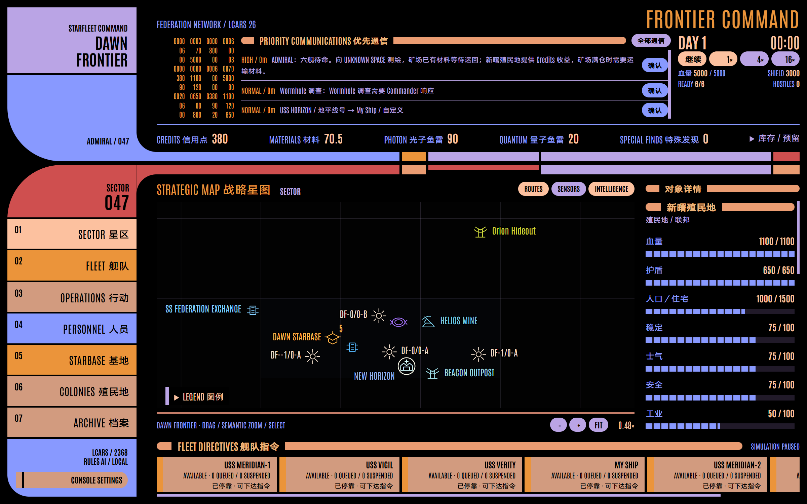

# STARFLEET: FRONTIER COMMAND

**Lv1 + Lv2 / v10 Dawn Frontier。玩家是拥有最终指挥权的 Admiral。**

沿用 Electron 主进程的持续世界和 LCARS 26 Classic 控制台：探索、建设、实际运输、殖民地发展、人员培养和持久势力。v10 提供中文对象详情、殖民地分段指标、弹仓与预留库存、永久生产五折、基地接管与改建、多基地本地生产、远景聚合和分散的远距离虫洞。保留隐形侦察、秘密尾随与现有指挥系统，没有 LLM 决策。



## 运行

```powershell
npm ci
npm run dev
# 或构建并启动 Electron
npm start
```

新世界暂停于 DAY 1 00:00，默认 1×。约一现实秒推进一游戏分钟；4× / 16× 重复相同的 0.1 游戏分钟固定步。重启暂停，不离线推进。

## 经济与指挥

矿场每五分钟最多开采 `7 × richness`，受有限矿藏、事故与 3000 Materials 仓位约束。满仓停产并报告一次，实际运输释放仓位后恢复。Dawn Materials 只来自运输、付费贸易交付和实际回收。

矿场事故需要派舰到场完成 20 工作并消耗 5 材料：优先使用矿场未预留库存，不足部分由当前到场响应舰货舱补足。缺料时保持停工、保留已完成工作，不超时失败；详情显示响应舰、材料缺口，并可打开“曙光 → 矿场”的一次性维修补给指令。材料补齐后继续响应即可恢复生产，旧存档的超额工作无需重做。

Colony 以 Credits 为核心产出：每千人口每五分钟基准 18 Credits，受工业、繁荣、Commander、事件等因素修正。保留人口、住宅、科研、安全、人员与 Cadet 培养。设施没有周期运营费或断供停工；医疗消耗现场预算。建设、造舰、改装和弹药工业支付预算与实际物资。

| 仓储     | Materials | Photon | Quantum | Special Finds |
| -------- | --------: | -----: | ------: | ------------: |
| Dawn     |      6000 |    500 |     200 |            50 |
| Mine     |      3000 |     30 |      10 |            10 |
| Colony   |       300 |     40 |      10 |            20 |
| Outpost  |       250 |     60 |      20 |            10 |
| Platform |       150 |     80 |      30 |            10 |

设施 Credits 费用：Mine 165、Outpost 200、Colony 280、Platform 190。造舰 Credits 费用：Peregrine 220、Antares 290、Constitution 550、Galaxy 860。Materials 与 Special Finds 原有费用保留。

舰船没有 Admiral 待办时原地待命。低弹药只报告；可选“已停靠时维修与装弹”只使用本地库存。战斗紧急撤退是远离实际威胁的本地脱离，结束后待命。RETURN / DOCK 必须由 Admiral 显式下达。REPLACE、QUEUE、INTERRUPT、编队、货物预留与永久舰损保留。

## v10 基地与生产

- 军械库基础等级即可制造光子和量子鱼雷；升级后新订单制造时间减半。
- 首次实际取得特殊发现后，所有基地造舰和弹药制造的预算、材料永久五折；特殊发现无需卸回基地，也不额外消耗。升级、维修和建设按原价。生产界面显示完整报价。
- Galaxy 的弹仓上限为光子 250、量子 50，基础航速为 10。新开局仍装载 36／12，新造舰空仓交付，已有舰船弹药保持原数量。
- 将敌方基地或前哨击败至血量归零后，派任意舰船到现场接管 10 游戏分钟；受击后等待脱离交火。随后支付 500 预算，运送 100 材料并施工 30 游戏分钟，改建为独立库存的己方基地。
- 基地管理可切换生产和服务基地。船坞、军械库、物流、传感器、防御的升级分别在对应页面操作，战略能力全指挥部共享。
- 装弹显示每舰弹仓、基地库存和预留数量；批量命令使用每舰相同数量，点击“装满可用余量”按所选舰船的共同余量和实际库存填入。
- 普通虫洞连接相距至少 8 星区的分散远方区域，可原路返回。旧普通虫洞也重新配对，固定曙光通道及既有舰船、设施、已探索区域的位置保留。
- 最远景使用覆盖整个视口的自适应网格与可点击展开的标记聚合。

## 指挥操作

时钟下方始终显示五项基地可用资源，实物可用量扣除正在执行或暂停指令的预留；展开可查看库存和预留。安全航线在没有已知危险时直达目的地，只避让已观测异常和威胁，不再强制经过殖民地或基地。

点击己方舰船选择，Ctrl 点击增选或取消；再点设施、接触、虫洞或坐标保留选舰。地图与底部舰船条同步显示选中状态，任务窗口继承全部选舰。临时多选不会创建编队；货运填写每舰数量，正式编队仍按原有总量分配。货舱与矿场提供“返回 Dawn／保留货物”和“返回 Dawn 并卸货”，已经装载的货物可直接送回。

实际穿越 Wormhole 后镜头跟随所选舰船到出口；拖图、缩放或选中其他对象结束跟随，正在编辑的指令和管理页保留。详情中的“下一步”根据公开情报提供现有指令入口，近距调查幽影残骸完成后立即可派舰现场接管。已接管残骸与清空的普通残骸可右键移除地图标记，实体和历史仍保存。

首次发现外部舰船、失联十分钟后重新发现，以及首次确认敌对会合并弹窗、播放警报音并暂停。确认、定位和下令都保持暂停，由 Admiral 手动继续；Romulan 未确认敌对时明确标注。隐形舰船使用独立轮廓、虚线状态环和文字标识。

基地升级按钮旁展示真实进度、剩余游戏分钟及暂停状态，施工中禁用重复升级，完成显示 ONLINE；造舰、制造和改装也展示实际进度。

## 幽影侦察与跟踪

FRONTIER 0/0 固定包含 DAWN PASSAGE，通往按 seed 确定性生成的 0/12。出口有唯一无人侦察舰：近距 SURVEY，随后 ASSIST_EVENT 接管 USS VEIL / 幽影号。接管事件不超时消失，舰船可改名、永久续存，被摧毁后永久损失。

Veil：Hull 70、Shield 45、Core 100、Core Regen 3、Warp 8、Cargo 10、Sensors 420、Science 110、两模块槽、单门 Phaser、无鱼雷。SHADOW 自动开启隐形；Inspector 可手动开关，手动关闭后当前指令不会重新开启。开火解除隐形，长期被动隐形可维持能源。

SHADOW 支持 Orion / Romulan，使用跟踪舰自己的实际传感器观测；失联仅搜索最后观测位置。普通尾随可能暴露，距离近、持续尾随会增加证据；敌舰识破后走假航点，确认脱离跟踪后才恢复真实航线。Romulan 反隐形与反跟踪更强。秘密尾随到真实目的地后，设施先显示为未知信号，连续现场侦察 10 游戏分钟才确认基地、允许后续打击。

## 地图与字体

Sector 生成 1–2 个系统，每系统 0–3 个行星、最多 6 个次级天体；系统间距至少 180，天体间距至少 60，距恒星至少 70。生成独立于探索顺序和战斗 RNG。

Sector / System / Local 采用分层显示；选中系统也可展开次级天体。共址设施与资源合并、停靠舰群聚合，保留 Inspector 和底部舰船选择。标签使用加载后字体的真实测量、稳定优先级和邻近避让；连线最长为当前字号的 4em，放不下时省略文字，悬浮和详情保留全名。

`src/ui/map/palette.ts` 集中定义 Federation 青蓝、Dawn 琥珀、Romulan 绿、Orion 酸性黄绿，以及固定天体语义色。图例可展开。

中文使用提供的阿里巴巴普惠体 Medium，英文与数字使用模板 Antonio。正文和粗体分别使用独立的中文字体资产，校准字面高度、基线及横竖笔画，标题保留 Antonio Bold；关闭浏览器伪粗体。规则覆盖原始混排文本、输入框和 SVG；原始字体与可复现的校准脚本见 [字体说明](fonts/README.md)。左侧导航和 LCARS 栏标题为同一行、相同字号的“英文 中文”；标题两端是统一颜色的 LCARS 色条。字体、原动画、音频与焦点行为可离线使用。正文默认约 18px，使用相对字号；控制台设置可分别调整文字大小和整体界面缩放至 100%–200%。Ctrl 加减调整整体缩放，Ctrl+0 仅重置整体缩放；窄窗口通过折行、滚动、可展开导航与详情抽屉适配，不强制缩字。

## 世界与保存

Renderer 只有只读公开 Snapshot，未知敌方基地、AI intent、真实目的地、反跟踪证据、假航点与随机源留在主进程及严格存档。地点情报仅公开玩家实际观测到的坐标和确认进度。

v10 使用独立 `timeline-v10.json` 与 `frontiers-v10/frontier-******/`。首次启动会验证并迁移整个 v9 时间线，v9 原文件保持原样；迁移失败时阻止覆盖。严格拒绝 v8 及更早世界。保留原子写入、每日快照、独立分支恢复、存档错误保护和永久舰损。全舰损后可通过 Colony 收入、有限贸易与 Shipyard 恢复。

## 验证

```powershell
npm test
npm run build
npm run test:e2e
node scripts/acceptance-v9.mjs 236807
```

[架构](docs/architecture.md) · [世界](docs/worldbuilding.md) · [验收](docs/acceptance.md) · [演示](docs/demo-script.md) · [验证记录](docs/verification.md)
