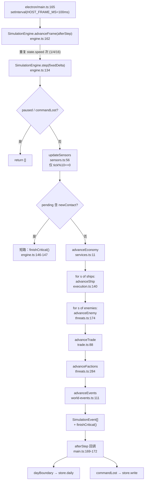
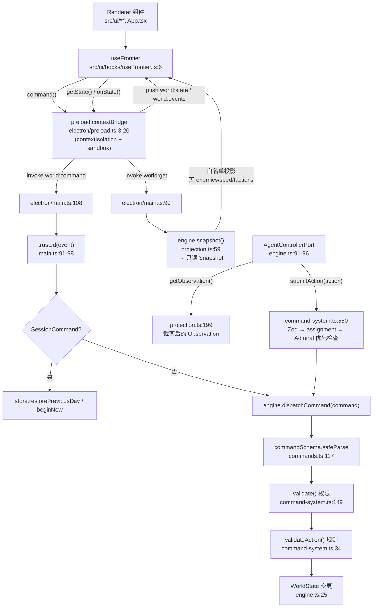

# Lv3 代码地图（00-code-map）

生成日期：2026-10-07
用途：Prompt 0 产物。让 Codex / 后续 Lv3 阶段**不必猜模块责任**——每条都经 import、调用链、类型与测试确认。

> **深度约定**：`src/engine/`（Lv3 主战场）做到**逐文件职责 + `step()` 调用链 + `advanceShip` 分发表 + 依赖方向**；`src/ui/`、`electron/`、`tests/`、`scripts/` 只到**逐文件一行职责 + Lv3 影响等级**。

代码总量：引擎 41 文件 / 8458 行；UI ~40 文件；electron 3 文件；tests 23 文件；scripts 9 个。

**Lv3 影响等级**定义：

| 等级 | 含义 |
| --- | --- |
| **高** | Lv3 几乎必然要改，或 Agent 行动必须穿过它 |
| **中** | 可能需要扩展，或承载 Agent 行动的执行/数据 |
| **低** | 仅需读取理解，预计不改 |
| **无** | 与 Lv3 无关 |

---

## 1. `src/engine/` 逐文件职责

### 1.1 编排与工厂

| 文件 | 行 | 导出 | 职责 | 影响 |
| --- | --- | --- | --- | --- |
| `engine.ts` | 185 | `SimulationEngine` | 世界权威持有者；RNG、日志、critical-pause、`step()` / `advanceFrame()`、`controllerPort()` | **高** |
| `data.ts` | 333 | `createWorld`, `makeShip`, `makeEnemy`, `makeLocation`, `emptyStock`, `BASE` | 工厂 + 初始世界播种；**`Operator`/`Assignment` 在此创建** | **中** |

### 1.2 命令与指令

| 文件 | 行 | 导出 | 职责 | 影响 |
| --- | --- | --- | --- | --- |
| `commands.ts` | 243 | `actionSchema`, `commandSchema`, `pointSchema`, `stockSchema`, `standingSchema`, … | **唯一输入验证语法**（Zod，全部 `.strict()`） | **高** |
| `command-system.ts` | 563 | `validate`, `validateAction`, `validateContinuation`, `dispatchCommand`, **`submitAction`**, `pay`, `canPay` | 校验 + 应用全部非 frontier 命令；指令入队 | **高** |
| `frontier-commands.ts` | 246 | `validateFrontierCommand`, `applyFrontierCommand` | 编队、人员任命、殖民地发展、贸易订单、事件响应 | 低 |
| `fleet.ts` | 153 | `groupPeers`, `groupSpeed`, `prepareGroupHaul`, `hasAdmiralWork`, `autonomousAllowed`, `advanceStanding` | 编队运动 + **Standing Orders 非交战自主行为**（撤退/紧急脱离/停靠服务/响应遇险/护航/巡逻；**不含 ROE**，ROE 在 `execution.ts:722`）。全部经 `validateAction`，首行 `hasAdmiralWork` 早退 | **中** |

### 1.3 逐舰执行

| 文件 | 行 | 导出 | 职责 | 影响 |
| --- | --- | --- | --- | --- |
| `execution.ts` | 739 | `go`, `advanceShip`, `autonomousFire` | **逐舰指令执行的唯一拥有者**；20+ action 分支（见 §3）。调用序：`regenerate`(`:142`) → `advanceStanding`(`:143`) → 紧急脱离分支(`:144-150`) → 则指令分派；`autonomousFire` 在 `:153`（无指令）与 `:719`（非交战指令收尾）被调用，**ROE 在此执行**(`:722`) | **中** |

### 1.4 战斗与情报

| 文件 | 行 | 导出 | 职责 | 影响 |
| --- | --- | --- | --- | --- |
| `combat.ts` | 223 | `regenerate`, `applyDamage`, `destroyShip`, `fire` | 护盾/核心回复、伤害、永久舰损与残骸、开火 | 低 |
| `sensors.ts` | 145 | `observe`, `updateSensors`, `visibleIntel` | 每 tick 情报记录、探测概率、接触警报与 critical pause | **中** |
| `tracking.ts` | 212 | `TRACKING_RULES`, `canDetectShip`, `updateCounterTracking`, `advanceEvasion`, `updateSiteIntel` | 隐形/探测数学、Romulan 反跟踪与甩尾、地点确认 | 低 |
| `threats.ts` | 368 | `decideThreat`, `advanceEnemy`, `advanceFactions` | **阵营 AI**：威胁报告、意图决策、敌方移动与劫掠、Romulan 姿态 | **中**（**现成的低频决策范式**） |

### 1.5 经济与社会

| 文件 | 行 | 导出 | 职责 | 影响 |
| --- | --- | --- | --- | --- |
| `services.ts` | 174 | `advanceEconomy` | 设施回复/自防、殖民地产出、矿场开采、建设项目、工业 job | 低 |
| `production.ts` | 36 | `productionCost`, `manufactureCost`, `unlockProductionDiscount`, `productionQuotes` | 成本与永久折扣数学 | 低 |
| `trade.ts` | 143 | `tradeReason`, `orderTrade`, `advanceTrade` | 民用运输船贸易订单生命周期 | 低 |
| `society.ts` | 121 | `personnelBonus`, `appointCommander`, `advanceSociety`, `canMeet`, `fundDevelopment` | 人员职业/训练/候选、殖民地成长 | 低 |
| `inventory.ts` | 74 | `inventory`, `heldDirectives`, `reservationHolder`, `available`, `space`, `deposit`, `loseStock` | **库存与预留记账的唯一真相源** | **中** |

### 1.6 世界与导航

| 文件 | 行 | 导出 | 职责 | 影响 |
| --- | --- | --- | --- | --- |
| `world-generation.ts` | 260 | `sectorId`, `sectorCenter`, `coordinateRandom`, `generatedSector`, `materialize`, `frontierSectors`, `VEIL_SITE` | 星系/天体/虫洞的确定性生成 | 低 |
| `wormhole-pairs.ts` | 43 | `fixedPassage`, `pairedSector` | 播种的虫洞星区配对 | 低 |
| `navigation.ts` | 200 | `dist`, `move`, `planRoute`, `routeEstimate`, `safeRouteBlocked`, `segmentDistance`, … | **寻路与移动**（可视性图 A*、危险规避） | 低 |
| `map-markers.ts` | 35 | `markerRemovalReason` | 地图标记可否移除的闸门 | 低 |

### 1.7 投影（公开视图）

| 文件 | 行 | 导出 | 职责 | 影响 |
| --- | --- | --- | --- | --- |
| `projection.ts` | 228 | `opportunities`, `snapshot`, **`getObservation`** | 战争迷雾过滤后的 `Snapshot` 与 `Observation` | **高** |
| `timeline.ts` | 12 | `TimelineSummary`, `TimelineStatus` | 纯类型；分支/回滚状态契约（无运行时） | 低 |

### 1.8 持久化

| 文件 | 行 | 导出 | 职责 | 影响 |
| --- | --- | --- | --- | --- |
| `save-schema.ts` | 741 | `worldSchema`（v10） | 当前 `WorldState` 完整 Zod schema + 交叉一致性校验 | **高** |
| `v9-schema.ts` | 124 | `colonySchema`, `personnelSchema`, `groupSchema`, `eventSchema`, `wormholeSchema`, `tradeSchema` | v10 与冻结 v9 **共享**的子 schema | **中** |
| `saves.ts` | 56 | `CURRENT_SAVE_VERSION`, `migrateV9`, `parseSave`, `UnsupportedSaveVersionError` | 版本闸门 + v9→v10 迁移 | **高** |

### 1.9 定义表（数据，无引擎依赖）

| 文件 | 行 | 导出 | 影响 |
| --- | --- | --- | --- |
| `definitions/freeze.ts` | 10 | `freezeDefinitions`, `DeepReadonly` | 低 |
| `definitions/ships.ts` | 255 | `SHIP_CLASSES`, `WEAPONS`, `MODULE_SLOTS`, `INITIAL_FLEET`, `ShipClassId` | **中**（Agent 可用的舰船能力面） |
| `definitions/rules.ts` | 20 | `RULES` | 低 |
| `definitions/progression.ts` | 83 | `MODULES`, `UPGRADES`, `FACILITIES`, `BUILD_COSTS`, `BASE_REFIT`, `cost` | 低 |
| `definitions/locations.ts` | 17 | `SECTOR_SIZE`, `BASE`, `INITIAL_LOCATIONS`, `regionAt` | 低 |
| `definitions/frontier.ts` | 42 | `STORAGE`, `DEFAULT_STANDING`, `CAREER_LABELS`, `TRADE_PRICES`, `DEVELOPMENT` | 低 |
| `definitions/factions.ts` | 6 | `FACTIONS` | **无 — 死代码** |
| `definitions/resources.ts` | 8 | `RESOURCE_DEFINITIONS` | **无 — 死代码** |

> ⚠️ **两个死文件**：`definitions/factions.ts` 与 `definitions/resources.ts` 全仓库（含 tests / scripts / electron）**零导入**，仅自身定义处出现。它们没有被任何文档记录。**Lv3 不要基于它们做设计**；若需要清理，应作为独立提交。

### 1.10 `legacy-v9/`（冻结的 v9 存档契约）

| 文件 | 行 | 说明 | 影响 |
| --- | --- | --- | --- |
| `legacy-v9/save-schema.ts` | 703 | 冻结的 v9 `worldSchema`，仅由 `saves.ts:3` 的 `migrateV9` 使用 | **无 — 禁止修改** |
| `legacy-v9/ships.ts` | 255 | 冻结的舰船表（含 v9 时代的容量） | 无 — 禁止修改 |
| `legacy-v9/commands.ts` | 232 | 冻结的 Zod schema | 无 — 禁止修改 |
| `legacy-v9/capabilities.ts` | 17 | 冻结的 `capabilities` / `cargoUsed` | 无 — 禁止修改 |

> `legacy-v9/` **不是死代码**——它是 v9→v10 迁移的活跃依赖（`saves.ts:3`）。名字里的 “legacy” 指的是它描述的存档版本，不是它的存活性。

---

## 2. `SimulationEngine.step()` 调用链

`src/engine/engine.ts:134-161`。按实际执行顺序（含早退）：

```text
step(fixedDelta = FIXED_DELTA)
├─ [guard] fixedDelta !== FIXED_DELTA → throw          engine.ts:135
├─ [guard] w.paused || isCommandLost() → return []     engine.ts:137
├─ w.tick++ ; w.time = w.tick / 10                     engine.ts:138-139
├─ gameCalendar(w.tick)  ※仅 tick % 14400 === 0        engine.ts:140-143   clock.ts:9
│     → events.push({type:'dayBoundary'})
├─ w.beams = w.beams.filter(未过期)                     engine.ts:144
├─ updateSensors(this)              ※仅 tick % 10 === 0 engine.ts:145      sensors.ts:56
├─ [early return] pending 含 newContact                  engine.ts:146-147
│     → return [...events, ...pendingEvents, ...finishCritical()]
├─ advanceEconomy(this, dt)                             engine.ts:148      services.ts:11
├─ for (s of [...w.ships])  advanceShip(this, s, dt)    engine.ts:149-152  execution.ts:140
├─ for (s of [...w.enemies]) advanceEnemy(this, s, dt)  engine.ts:153-156  threats.ts:174
├─ advanceTrade(this, dt)                               engine.ts:157      trade.ts:88
├─ advanceFactions(this, dt)                            engine.ts:158      threats.ts:284
├─ advanceEvents(this, dt)                              engine.ts:159      world-events.ts:111
└─ return [...events, ...pendingEvents.splice(0), ...finishCritical()]  engine.ts:160
```

**三个必须注意的顺序事实**：

1. `updateSensors` 在**逐舰循环之前**运行，且**只在每 10 tick（= 1 游戏分钟）**执行一次。
2. `newContact` critical 会**短路整个 tick**——发现新接触时，后续所有系统这一步都不执行。
3. 每步都 `[...w.ships]` 做浅拷贝再遍历，因此循环内新增/移除舰船不会破坏迭代。

**`advanceFrame` 包装**（`engine.ts:162-171`）：按 `state.speed`（1/4/16）重复 `step()`，`paused` 立即停；每步后调用宿主的 `afterStep` 回调（`electron/main.ts:169-172` 用于日快照与 COMMAND LOST 落盘）。

---

## 3. `advanceShip` 分发表（逐舰指令执行）

`src/engine/execution.ts:140`。这是**唯一**处理 `Directive.action` 的地方。

| 顺序 | Action | 行 | 备注 |
| --- | --- | --- | --- |
| 0 | （无 current） | `:153` | 走 `autonomousFire` |
| 0 | `emergencyRetreat` 分支 | `:144-150` | **在指令分派之前**处理 |
| 1 | `RETURN` | `:158` | |
| 2 | `ASSIST_EVENT` | `:163` | → `assistEvent`（`world-events.ts:244`） |
| 3 | `HAIL` | `:165` | |
| 4 | `CAPTURE` | `:199` | |
| 5 | `TRANSIT` | `:232` | |
| 6 | `MOVE` | `:288` | |
| 7 | `EXPLORE` | `:298` | |
| 8 | `SURVEY` | `:318` | |
| 9 | `HAUL` | `:369` | |
| 10 | `SHADOW` | `:456` | |
| 11 | `ATTACK` / `DISABLE` / `DRIVE_OFF` / `INTERCEPT` | `:506-558` | 四者合并一个分支块 |
| 12 | `ESCORT` | `:559` | |
| 13 | `PATROL` | `:577` | |
| 14 | `RECOVER` | `:591` | |
| 15 | 停靠/服务兜底 `arrivedService` | `:608` → `execution.ts:126` | `RETREAT`/`DOCK` `:609`、`UNLOAD` `:612`、`REPAIR` `:624`、`REARM` `:642`、`REFIT` `:676` |
| — | 非战斗指令后的自动开火 | `:714-719` | 分派后的统一收尾 |

> **对 Lv3 的意义**：Agent 提出的任何 `Action` 最终都会落进这张表。**这张表不需要为 Lv3 新增分支**——Lv3 的价值在于*选择*已有 Action，而不是发明新的物理行为。

---

## 4. 引擎依赖方向

```text
types.ts ◄────────────────── 几乎所有模块（纯类型，无出边）
definitions/* ◄───────────── 只依赖 freeze.ts（纯数据表）
commands.ts ◄─────────────── save-schema, v9-schema, command-system, legacy-v9/*
inventory.ts ◄────────────── 被 8 个模块依赖（预留记账的唯一真相源）

engine.ts ──► {trade, world-events, clock, data, command-system,
               projection, execution, threats, services, sensors, combat}

execution.ts ──► {production, inventory, fleet, world-events, society,
                  capabilities, navigation, combat, command-system,
                  world-generation, definitions/*, tracking}

command-system.ts ──► {production, inventory, frontier-commands, commands,
                       data, capabilities, definitions/*, map-markers}
frontier-commands.ts ──► command-system  ← 唯一的反向依赖（双向耦合）
```

**唯一需要注意的耦合**：`command-system ↔ frontier-commands` 互相依赖（`command-system.ts:5` 与 `frontier-commands.ts` 的回引）。改动前者时必须同时看后者。

`projection.ts` 只被 `engine.ts` 依赖——它是**唯一**产出公开视图的地方，Lv3 的信息隔离必须从这里改。

---

## 5. `src/ui/` 逐文件职责

### 5.1 顶层

| 文件 | 职责 | 影响 |
| --- | --- | --- |
| `main.tsx` | React 引导：LCARS 全局 CSS，挂载 `<LcarsProvider><App/></LcarsProvider>` | 无 |
| `App.tsx` | 根外壳；持有全部顶层 UI 状态（page、selection、多选舰、跟随、目标点、composer、设置） | **低**（Agent UI 若要呈现，入口在此） |
| `StrategicMap.tsx` | 导出 `Selection` 联合类型 + `StrategicMap` 星区地图（SVG、相机、标签、聚合、右键菜单） | 低 |
| `global.d.ts` | `Window.frontier` 环境类型，对应 preload 桥 | 无 |
| `ui/types.ts` | `Page`（7 值联合）、`CommandSender`、`Notice` | 无 |

### 5.2 功能视图

| 文件 | 职责 | 影响 |
| --- | --- | --- |
| `ui/FleetManager.tsx` | FLEET 页：编队 CRUD、成员、旗舰、间距 | 低 |
| `ui/EventsView.tsx` | OPERATIONS 页：持久世界事件与响应 | 低 |
| `ui/PersonnelView.tsx` | PERSONNEL 页：候选接受/训练、职业、任命 | **低**（未来 Agent 人员视图的最近邻） |
| `ui/TradeView.tsx` | COLONIES/贸易页：交易所买卖、民用运输船状态 | 低 |
| `ui/StandingPanel.tsx` | 单舰 Standing Orders 编辑器（ROE、撤退阈值、保护开关） | **中**（Agent 的“自主策略”与 UI 已有控件同构） |
| `ui/Inspector.tsx` | 对象详情面板，覆盖所有 `Selection` 类型 | 低 |
| `ui/OrderComposer.tsx` | Admiral 指令下达对话框；`ComposerRequest` / `defaultAction` | **中**（Agent 下达路径的 UI 对应物） |
| `ui/ManagementDrawer.tsx` | 非 SECTOR 页的覆盖层宿主；`STARBASE_MODULES`（8 个基地模块）与 page 路由 | 低 |
| `ui/ContextGuidance.tsx` | “NEXT STEP” 上下文提示，只读公开 Snapshot | 低 |
| `ui/MineAccidentStatus.tsx` | 矿场事故状态与补给动作 | 无 |
| `ui/ContactAlert.tsx` | 首次接触弹窗（暂停模拟） | 低 |
| `ui/CommandLost.tsx` | COMMAND LOST 对话框（恢复昨日/新边疆/档案） | 无 |

### 5.3 共享工具

| 文件 | 职责 | 影响 |
| --- | --- | --- |
| `ui/localization.tsx` | 双语显示层：`ChineseDisplay`、`displayName`、`worldText`（保护玩家改名） | 无 |
| `ui/format.ts` | `ACTION_LABELS`、`actionProgress`、`GOODS_LABELS`、`describe` 等 | 低 |
| `ui/rearm.ts` | 纯函数 `rearmPreview`（可用量、预留、每舰上限、校验错误） | **低**（纯函数，可被 Lv3 复用） |
| `ui/components/Lcars.tsx` | LCARS 原语：Button/Elbow/Bar/TextBar/Panel/Field/Meter/Frame/Drawer/Dialog | 无 |
| `ui/components/LcarsShell.tsx` | 控制台外壳；导出 `PAGES`（7 页）、`LABELS` | 无 |
| `ui/components/bilingual.ts` | `bilingualTitle` 英中标题映射 | 无 |
| `ui/components/ProductionPrice.tsx` | 折后价格显示 | 无 |
| `ui/components/WorkProgress.tsx` | 进度条 | 无 |
| `ui/hooks/useFrontier.ts` | **Renderer 唯一状态与命令钩子**（见 §7） | **低**（Agent 状态若需呈现，在此接入） |
| `ui/lcars/LcarsProvider.tsx` | 偏好、文字/界面缩放、键盘缩放、音频解锁 | 无 |
| `ui/lcars/ConsoleSettings.tsx` | 控制台设置抽屉 | 无 |
| `ui/lcars/DataCascade.tsx` | 装饰性数字级联动画 | 无 |
| `ui/lcars/WorldFeedback.tsx` | 无头音频事件桥 | 无 |
| `ui/lcars/audio-manager.ts` / `web-audio.ts` | 音频优先级/冷却/去重；WebAudio 驱动 | 无 |
| `ui/lcars/preferences.ts` | `ConsolePreferences`、`parsePreferences`（v1→v2 迁移与钳制） | 无 |
| `ui/lcars/usePanelFocus.ts` | 焦点陷阱 / Escape / 焦点恢复 | 无 |
| `ui/lcars/styles/*.css` | tokens / controls / console / panels / map / motion / accessibility | 无 |
| `ui/map/MapSymbol.tsx` | SVG 符号字形库 `SYMBOLS` | 无 |
| `ui/map/camera.ts` | 纯相机数学：`fitCamera`、`project`、`viewportGrid`、`clusterMarkers`、`placeLabels` | 无 |
| `ui/map/palette.ts` | `MAP_PALETTE` 与阵营/天体语义色 | 无 |

**页面路由表**（`src/ui/types.ts:2-9` 的 `Page` 联合；`LcarsShell.tsx:11-19` 的 `PAGES`）：

| Page | 渲染者 | 位置 |
| --- | --- | --- |
| `SECTOR` | `StrategicMap` | `App.tsx:290-302` |
| `FLEET` | `FleetManager` | `ManagementDrawer.tsx:133` |
| `OPERATIONS` | `EventsView` | `ManagementDrawer.tsx:453` |
| `PERSONNEL` | `PersonnelView` | `ManagementDrawer.tsx:491` |
| `STARBASE` | 基地页签 + `STARBASE_MODULES`（8 模块） | `ManagementDrawer.tsx:21, 136-450` |
| `COLONIES` | 殖民地/矿场/前哨 + 建设项目 | `ManagementDrawer.tsx:492-523` |
| `ARCHIVE` | 损失/时间线/历史 | `ManagementDrawer.tsx:524-560` |

---

## 6. `electron/` 逐文件职责

| 文件 | 行 | 职责 | 影响 |
| --- | --- | --- | --- |
| `main.ts` | 208 | 主进程：protocol、单实例锁、**持有唯一的 SaveStore 与 SimulationEngine**、固定间隔 `advanceFrame` 循环、7 条 IPC、自动保存、窗口 | **高**（Lv3 的 LLM host 应在此层） |
| `preload.ts` | 20 | `contextBridge.exposeInMainWorld('frontier', …)`——**唯一的 renderer↔main 桥** | **中** |
| `persistence.ts` | 261 | `SaveStore`：v10 分支、原子写、同代备份、损坏保留、失败封存、v9→v10 迁移 | **高** |

---

## 7. 两张必需的数据流图

### 7.1 模拟侧：SimulationEngine → step/advanceFrame → 各系统



### 7.2 玩家/Agent 侧：Renderer → IPC → Command → Main → Engine



> **对 Lv3 的关键**：图中 `AGENT` 节点是**已经存在**的，且它的 `submitAction` 已经汇入与玩家相同的 `DISP` → `VAL` → `V1` → `V2` 链路。**Lv3 不需要新建第二条通往引擎的路**。

---

## 8. `tests/` 与 `scripts/` 一行职责

测试与脚本的逐文件清单见 `00-test-baseline.md` §2 与 §3（避免重复维护两份）。此处只记边界：

- `tests/**/*.test.ts` → Vitest 单测，**不启动 Electron**。
- `tests/e2e/**` → Playwright spec，**启动真实生产 Electron**，用 `FRONTIER_USER_DATA` 指向临时目录，经 `SaveStore` 预置世界。
- `tests/e2e/typography.ts`、`tests/helpers.ts`、`tests/recon-scenarios.ts` 是**辅助模块，不是测试文件**（文件名不含 `.spec`/`.test`）。

---

## 9. 本图确认的“不要猜”清单

| 容易猜错的地方 | 实际情况 |
| --- | --- |
| `legacy-v9/` 是废弃代码 | **不是**——它是 `migrateV9` 的活跃依赖 |
| `timeline.ts` 是引擎模块 | 纯类型，被 UI 与 electron 使用，引擎不依赖它 |
| `projection.ts` 是“UI 的东西” | 它是引擎内**唯一**产出公开视图的地方，信息隔离在此 |
| UI 会被打进 Electron 产物 | `tsconfig.electron.json` **不含 `src/ui/`** |
| `standing` 全部由 `fleet.ts` 驱动 | 分两处，都在规则层：`fleet.ts:49` `advanceStanding`（撤退/服务/护航/巡逻）+ `execution.ts:721` `autonomousFire`（**ROE**）。`fleet.ts` 全文不含 `roe` |
| 引擎里有敌方 AI 架构可照搬给 Agent | 有可参考的**低频决策范式**（`Enemy.nextDecision`，`types.ts:298`），但它是模拟时间 deadline，**不含任何模型调用** |
| `definitions/factions.ts` / `resources.ts` 有用 | **死代码**，零导入 |
