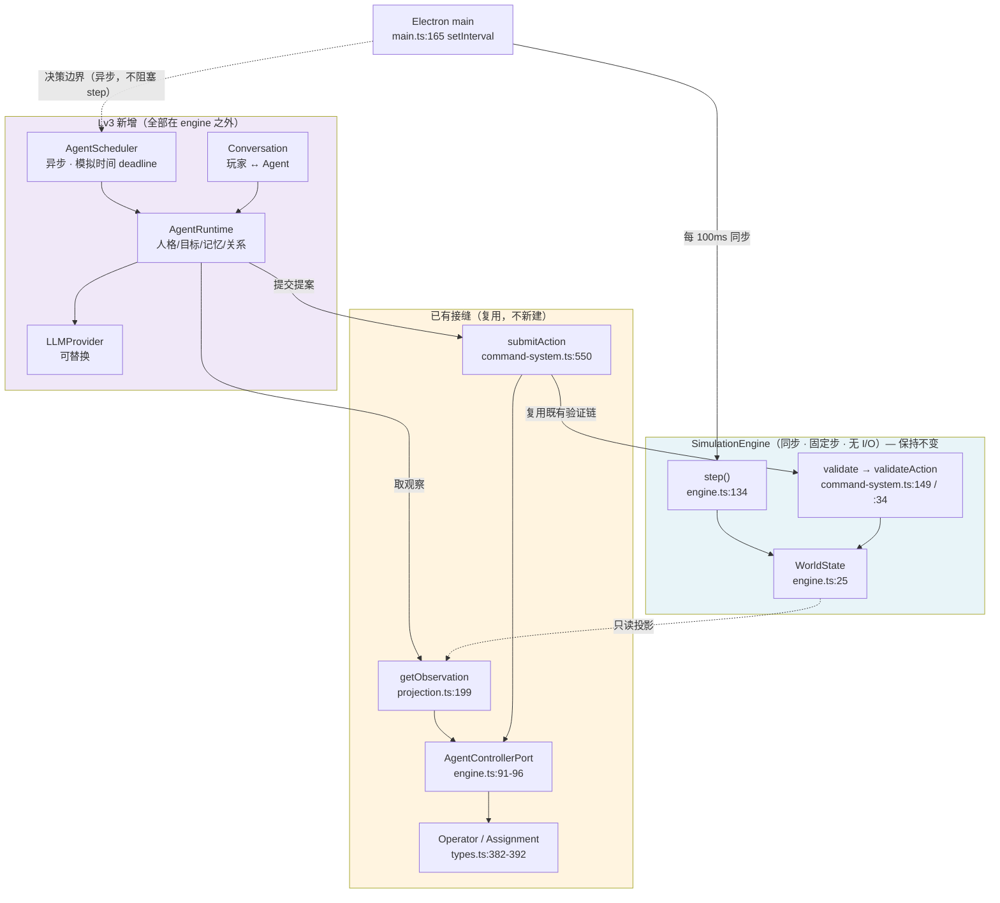

# Lv3 Agent 缺口分析（01-agent-gap-analysis）

生成日期：2026-10-07
用途：Prompt 1 产物。回答「已有的 Agent 边界是什么、与 Lv3 需求差多少、插入点在哪、哪些东西 AI 容易猜错」。

> 本文**不实现** Lv3，也不定义最终的 Goal / Memory / Planner / Schema——那是 Prompt 2 的范围。本文只做现状反构与差距判定。

---

## 1. 已有「半成品边界」的精确反构

Lv3 需要的一切接缝**都已存在**，但**没有任何自主决策实现**。

### 1.1 六个要素

| 要素 | 定义 / 实现 | 现状 |
| --- | --- | --- |
| `operatorId` | `Operator.id`（`types.ts:383`） | 每艘初始舰一个，`data.ts:175-181` 生成 `ops-<shipId>` |
| `assignment` | `Assignment`（`types.ts:388-392`） | `operatorId ↔ shipId` **1:1 且唯一**（`save-schema.ts:521-532`） |
| `AgentControllerPort` | `types.ts:653-656` | 恰好两个方法，`Object.freeze`（`engine.ts:91-96`） |
| `getObservation()` | `projection.ts:199-228` | 裁剪后的 `Observation`；无分配返回 `null` |
| `submitAction()` | `command-system.ts:550-563` | Zod → assignment → Admiral 优先 → `dispatchCommand` |
| `current`/`queue`/`suspended` | `Ship`（`types.ts:275-277`） | 三容器，语义见 `01-state-and-command-map.md` §3.1 |

### 1.2 `submitAction` 的完整语义（逐行）

```text
submitAction(operatorId, input)                        command-system.ts:550
├─ actionSchema.safeParse(input)                       :551
│    失败 → no('结构化动作格式无效')                      :552
├─ 查 assignments → 找 ship                             :553-555
│    无 ship → no('执行主体不可用')                        :555
├─ 三容器中存在任一 source==='admiral' 的指令             :556
│    → no('Admiral 当前、队列和挂起指令优先')              :557
├─ s.current / queue / suspended 任一非空                :558
│    → no('执行主体正在完成既有行动')                      :558
└─ dispatchCommand({ issueDirective, [本舰], QUEUE }, operatorId)  :559-562
```

### 1.3 三个由此推出的、必须知道的结论

**结论 1：Agent 指令的 `source` 是 `'standing'`，不是 `'agent'`。**
`source` 类型只有 `'admiral' | 'standing'`（`types.ts:254`）。`dispatchCommand` 在 `command-system.ts:393` 按 `actorId === w.commander.id` 赋值；`submitAction` 传的是 `operatorId`，必不等于 `commander.id`，故**恒为 `'standing'`**。

**结论 2：Agent 指令不受 Admiral 保护。**
`hasAdmiralWork`（`fleet.ts:39-41`）判定 `source === 'admiral'`。`advanceStanding` 首行 `if (hasAdmiralWork(s)) { s.emergencyRetreat = null; return; }`（`fleet.ts:50-53`）——**Agent 指令不触发这个早退**。随后 `fleet.ts:81-91` 的紧急脱离分支在 `:84` 执行 `s.current = null`，**不看指令来源**。

> 因此：舰船受损、且 12 游戏分钟内被攻击时，一个 Agent 刚下达的指令**会被静默清除**，Agent 只能从下一次 `Observation` 发现指令消失。playbook 的 Prompt 2 列出了 `stale observation` / `Admiral superseded` 两类失效，**未列这一类**，需在设计阶段补上。

**结论 3：`QUEUE` 对 Agent 不是「排队」。**
`command-system.ts:378` 的入队条件是 `s.current?.source === 'admiral'`。`submitAction` 已保证下发时三容器皆空（`s.current === null`），故条件为假 → 落入 `else` → `s.current = d` 直接执行。**Agent 的 `submitAction` 实际语义是「立即执行」**，尽管它传的是 `mode: 'QUEUE'`。

### 1.4 可执行护栏

`tests/architecture.test.ts:9-31` 把上述契约固化为断言：

| 断言 | 行 | 含义 |
| --- | --- | --- |
| `Object.keys(port).sort() === ['getObservation','submitAction']` | `:13` | **端口恰好两个方法**——扩展必撞 |
| `port.submitAction({MOVE}).ok === true` | `:14` | 合法动作可通过 |
| `port.submitAction({DOCK}).ok === false` | `:15` | 规则层会拒绝 |
| `dispatchCommand(..., 'ops-verity')` 对非本舰 → `false` | `:17-26` | 越权拒绝 |
| `controllerPort('unknown').getObservation() === null` | `:27` | 无分配返回 null |

---

## 2. Gap Analysis

| Current capability | Existing code | Lv3 need | 处置 | Risk |
| --- | --- | --- | --- | --- |
| 单位身份仅为 `Operator{kind:'rules'}` | `types.ts:382-387` | 至少 2 个有**可计算参数差异**的 Agent（题面 Lv3 §1） | **Extend** | 中——`kind` 是 save schema 字面量 |
| 1:1 `Assignment` | `types.ts:388-392`，`save-schema.ts:521-532` | Agent↔角色绑定 | **Keep** | 低 |
| `AgentControllerPort`（2 方法） | `engine.ts:91-96` | 相同的观察/提交边界 | **Keep + Extend** | 中——扩展撞 `architecture.test.ts:13` |
| `Observation` 只含本舰 + 公共子集 | `projection.ts:199-228` | 需「公司当前状况」「其他 Agent 关系」（题面 Lv3 §1） | **Extend** | 中——数据已在 `snapshot()`，属选子集 |
| `legalActions` 硬编码且与规则不符 | `projection.ts:212-226` | 可信的合法动作集 | **Refactor 或降级为提示** | **高**——若被模型当成权威会持续产生无效动作 |
| `submitAction` 的 Admiral 优先 | `command-system.ts:556-558` | 「Agent 不必无条件服从」（题面 Lv3 §2） | **Keep + Extend** | 中——是张力落点，不能破坏既有语义 |
| `source` 只有 amiral/standing | `types.ts:254`，`command-system.ts:393` | 区分 Agent 自主指令 | **Extend** | 中——影响 `hasAdmiralWork` 判定 |
| 无决策点/调度器 | `step()` 内无任何 agent 钩子（`engine.ts:134-161`） | 显式 decision boundary | **Create** | 中——必须落在 `step()` 之外 |
| 敌方 AI 的 sim-time deadline | `threats.ts:79-80` | 低频决策的节拍范式 | **Keep（作为参照）** | 低 |
| 无 Agent 记忆/目标/关系 | 无任何代码 | 题面 Lv3 §1、§4 | **Create** | 中 |
| 无对话影响状态的通道 | 无任何代码 | 题面 Lv3 §2（对话须改变至少一项状态） | **Create** | 中 |
| 无 LLM / provider 抽象 | 全仓库零命中 | 模型驱动的决策 | **Create** | **高**——从零开始 |
| `WorldState` v10 严格闸门 | `saves.ts:49-56` | 持久化 Agent 状态 | **Extend（v11 + 迁移）** | **高**——破坏存档即破坏 Lv1/Lv2 |
| 固定步 + 确定性重放 | `engine.ts:135`，`architecture.test.ts:39-60` | 必须保持 | **Keep（不可变）** | **高**——非确定性会直接破坏回归 |
| 公开/私有信息边界 | `projection.ts:59-198` | Agent 不得见他人私有状态 | **Keep** | 高——泄漏即架构违规 |
| LCARS UI | `src/ui/**` | 可选的 Agent 呈现 | **Keep（尽量不动）** | 低 |

---

## 3. LLM 异步性 vs 同步 `step()` 的冲突

### 3.1 冲突的量级

| 事实 | 值 | 位置 |
| --- | --- | --- |
| `step()` 是同步纯函数式推进 | 无 Promise / 无 `await` / 无 I/O | `engine.ts:134-161` |
| 1× 时 `step()` 调用频率 | 10 次/秒 | `HOST_FRAME_MS = 100`，`speed = 1` |
| 16× 时 | **160 次/秒** | `advanceFrame` 循环 `speed` 次 |
| 典型 LLM 往返延迟 | **秒级** | 比一次 `step()` 慢 3–4 个数量级 |

### 3.2 明确禁止

> ### ⛔ 禁止在 `SimulationEngine.step()` 内每个 tick 调用 LLM

理由（三重，任一独立成立即可否决）：

1. **确定性崩塌**：`step()` 的确定性是 `tests/architecture.test.ts:39-60` 的断言对象。网络结果不可重放。
2. **性能崩塌**：16× 下每秒 160 次网络调用。
3. **架构违规**：CLAUDE.md §2.4 与 AGENTS.md「引擎边界」均要求「LLM 慢、不可用或返回无效输出时模拟仍然确定且可响应」。

### 3.3 正确形态

```text
SimulationEngine（同步、固定步、无 I/O）        engine.ts:134
        ▲
        │ 只接受「已验证的 Action」              command-system.ts:34 / :149
        │
AgentScheduler（异步编排，位于 engine 之外）
        ▲
        │ async
LLMProvider
```

**三个必须满足的条件**：

1. **决策触发点用模拟时间表达**，照搬 `decideThreat` 的 `s.nextDecision` 范式（`threats.ts:79-80`，`RULES.decisionInterval = 5`），但**实际模型调用发生在 `step()` 之外**。
2. **模型结果回注必须走既有验证链**——即 `submitAction` 或其等价入口，不得新建绕过 `validate` 的路径（`applyFrontendCommand` 只有一个调用点，`command-system.ts:349`，这是可审计的）。
3. **模型慢不阻塞世界**：`step()` 照常推进；若结果回来时该舰已被 Admiral 接管或已失效，**必须安全丢弃**。

### 3.4 确定性策略（不虚假宣称）

不得声称「同样输入 LLM 必得同样输出」。应区分三种模式：

| 模式 | 用途 |
| --- | --- |
| deterministic engine replay | 既有能力，保持不变 |
| recorded agent decision fixture | 回归测试：录制决策，重放不依赖网络 |
| live LLM mode | 人工演示；**不参与回归断言** |

---

## 4. `Operator` 与未来 `Agent` 的关系

题面要求「不要自动把 Operator 改名为 Agent」。以下比较三种方案。

### 4.1 三个方案

**方案 A：扩展 `Operator`**
- 把 `kind` 从 `'rules'` 扩为 `'rules' | 'agent'`，并把人格/目标/记忆字段直接加到 `Operator` 上。
- 优点：实体最少，`Assignment` 与 `AgentControllerPort` 完全不动。
- 缺点：`Operator` 目前是 6 行的薄身份记录，塞入人格/记忆/目标后变成 god struct；且**Agent 属性与「舰船绑定」是正交概念**，混在一起会让「一个 Agent 换舰」和「一艘舰换 Agent」都变得难以表达。

**方案 B：`Agent` 独立实体 + `Operator` 保留兼容层**（推荐）
- `Agent` 成为新实体，承载人格/目标/记忆/关系/生涯；`Operator` 保持现有身份与绑定契约不变；二者通过引用关联（Agent 使用某个 Operator 提交动作）。
- 优点：
  - **符合 CLAUDE.md §2.2 的边界**——Agent 拥有的是「人格、技能、目标、记忆、关系、士气、生涯、决策历史」，这些**不属于舰船物理状态**，也不该混进「舰船绑定记录」。
  - `AgentControllerPort` / `Assignment` / `submitAction` **完全不需要改签名**——它们本来就是按 `operatorId` 工作的。
  - `kind: 'rules'` 保留为既有 operator 的兼容取值，新增部分是**追加式**的。
  - Lv1/Lv2 的存档与行为路径**不被触碰**。
- 缺点：多一层实体与映射，需要在 Prompt 2 明确 Agent↔Operator↔Ship 的三者关系。

**方案 C：`Agent` 直接替代 `Operator`**
- 删除 `Operator`，全面改用 `Agent`。
- 优点：概念最干净，只有一个实体。
- 缺点（致命）：
  - `kind: z.literal('rules')`（`save-schema.ts:158`）被打破，**每一份既有存档都要迁移**。
  - `legacy-v9/` 的冻结契约描述的仍是 `Operator`，**而它不得修改**（`architecture.md:185`）——迁移代码必须同时理解两个模型。
  - `combat.ts:108` 的 `vesselLost` 联动、`save-schema.ts:521-532` 的唯一性校验都要重写。
  - 与 CLAUDE.md §3「不要重写 Lv1/Lv2」直接冲突。

### 4.2 选择：**方案 B**

三条决定性理由：

1. **边界正确性**。CLAUDE.md §2.2 明确区分「Agent 拥有的东西」与「世界物理状态」。`Operator`/`Assignment` 是**世界状态**（在 `WorldState` 里、随存档持久化）；Agent 的人格与记忆是**另一类**。方案 A 把它们混为一谈，方案 C 让 Agent 直接变成世界状态实体——两者都模糊了这条边界，而这条边界正是整个 Lv3 架构的地基。
2. **兼容成本**。方案 C 必须重写存档迁移与冻结契约的消费者，风险直接落在 Lv1/Lv2 上。方案 B 是**追加**：既有 `Operator` 一行不改也能跑。
3. **接缝已是现成的**。`controllerPort(operatorId)` → `Assignment` → `shipId` 这条链（`engine.ts:91-96`）设计的正是「一个操作者操作一艘舰」。Agent **复用**这条链即可，无需新造第二条通往引擎的路。

> **留给 Prompt 2 的决定**：Agent 状态**存在哪里**（`WorldState` 的新顶层字段 vs 独立存档区）属于持久化策略，本文不预设。约束是：只有引擎写存档，且迁移必须走 v11 + staged 模式（`saves.ts:migrateV9`、`persistence.ts:migrateTimeline` 已有先例）。

---

## 5. Lv3 预期插入点（只画边界，不写实现）



**边界规则**（图中虚线/实线的含义）：

- `NEW` 区块中的任何组件**不得**直接写 `WorldState`，**不得**被 `step()` 调用。
- `AgentScheduler` 与 `step()` 之间**只有单向的、经过验证的动作流**。
- `SEAM` 区块是 Lv1/Lv2 已经建好的，Lv3 应当**复用而非绕开**。

---

## 6. DO NOT ASSUME

记录本项目中最容易被 AI 按「常见游戏架构」猜错的地方。**每一条都已回源码核实。**

| # | 容易猜成 | 实际情况 | 依据 |
| --- | --- | --- | --- |
| 1 | `legalActions` 是合法动作的权威来源 | **不是**。硬编码，漏 12 个可执行动作，又无条件列出 3 个受约束动作 | `projection.ts:212-226` |
| 2 | 存在 `source: 'agent'` | **不存在**。只有 `'admiral' \| 'standing'`；Agent 指令恒为 `'standing'` | `types.ts:254`，`command-system.ts:393` |
| 3 | Agent 指令受 Admiral 同等保护 | **不受**。`hasAdmiralWork` 只认 `'admiral'`；紧急脱离可在 `fleet.ts:84` 静默清除 Agent 指令 | `fleet.ts:39-41,50-53,81-91` |
| 4 | `mode: 'QUEUE'` 会排队 | 对 Agent **不会**。入队条件要求 `current.source === 'admiral'` | `command-system.ts:378` |
| 5 | 排队指令会预留库存 | **不会**。`heldDirectives` 只扫 `current` + `suspended` | `inventory.ts:19-20` |
| 6 | 有燃料系统 | **没有**。`Ship` 无 fuel 字段，全仓库无相关引用；航行只受时间约束 | `types.ts:261-291` |
| 7 | 敌方 AI 由模型驱动 | **不是**。纯规则，`decideThreat` 每 5 游戏分钟一次，无任何模型调用 | `threats.ts:76-80` |
| 8 | `legacy-v9/` 是废弃代码 | **不是**。它是 `migrateV9` 的活跃依赖，且**禁止修改** | `saves.ts:3`，`architecture.md:185` |
| 9 | `Operator` 已经是一个 Agent | **不是**。6 行身份记录，`kind` 只有 `'rules'`，无人格/目标/记忆 | `types.ts:382-387` |
| 10 | Renderer 可以承载 LLM 调用 | **不能**。`contextIsolation` + `sandbox` + 无 Node 权限；密钥不能进 Renderer | `main.ts:73-75` |
| 11 | `main.ts` 下发命令时传了 `actorId` | **没传**，默认 `'commander'`，故操作者权限门恒通过 | `main.ts:131`，`command-system.ts:343,159-167` |
| 12 | 所有世界变更都留历史 | **不是**。`upgrade`/`manufacture`/`standingOrders`/`acknowledge`/`pause`/`speed` 不写 `history` | `command-system.ts:505-519,521-535,415-418,370-373` |
| 13 | `applyFrontierCommand` 只处理 frontier 命令 | **对每种命令都调用**，非 frontier 返回 null | `command-system.ts:349`，`frontier-commands.ts:245` |
| 14 | `definitions/factions.ts` / `resources.ts` 有用 | **死代码**，全仓库零导入 | 见 `00-code-map.md` §1.9 |
| 15 | `SPECIAL FINDS` 需要卸回基地才生效 | **不需要**。取得即永久解锁五折 | `README.md:43` |
| 16 | `step()` 可以改成异步 | **不可以**。改步长直接抛错，且 `architecture.test.ts:39-60` 依赖同步确定性 | `engine.ts:135` |
