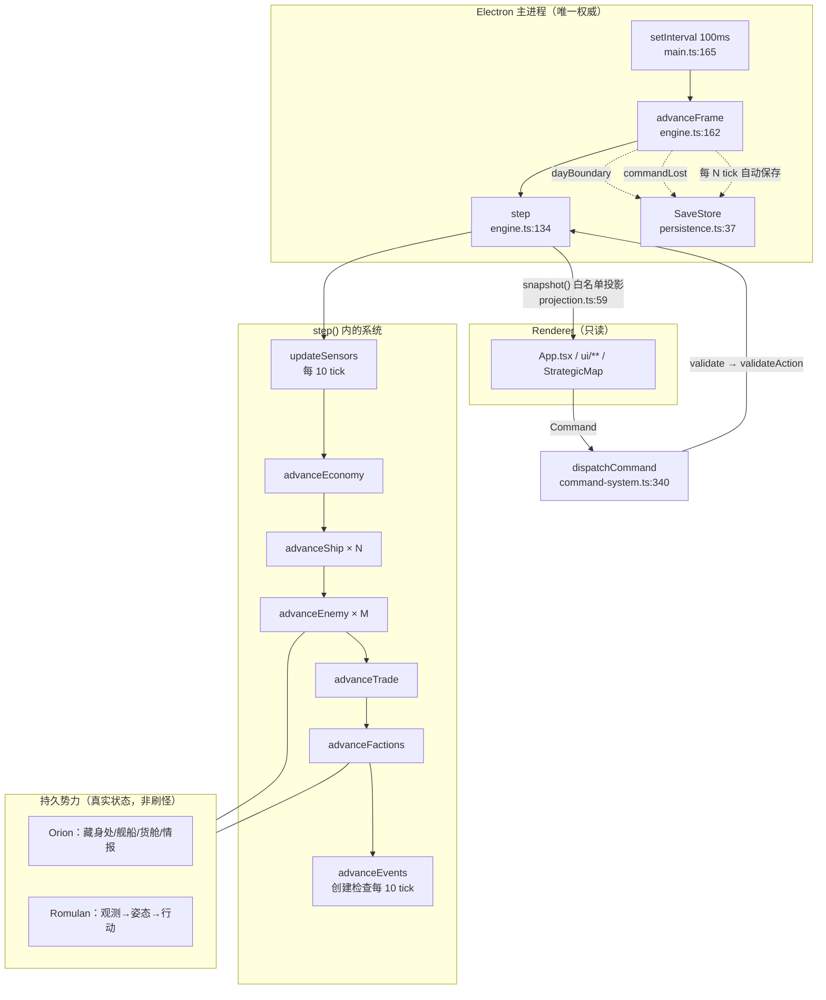

# Lv1/Lv2 架构反构（01-lv1-lv2-architecture）

生成日期：2026-10-07
用途：Prompt 1 产物。把「当前游戏到底怎么运行」反构成可被 Codex 阅读的系统规格。

> **方法**：所有结论来自实际源码、类型与测试。凡引用的行号均在写入前回原文核对过。
> **范围**：本文回答「系统由什么构成、各部分的规则边界在哪」。**调用时序**见 `01-runtime-call-graph.md`；**状态与命令的对应关系**见 `01-state-and-command-map.md`；**与 Lv3 的差距**见 `01-agent-gap-analysis.md`。

---

## 0. 一句话概括

Frontier Command 是一个**单机、确定性、固定步长的边疆生态模拟**：Electron 主进程持有唯一权威的 `SimulationEngine`，Renderer 只有只读投影；玩家以 Admiral 身份下达结构化意图，引擎负责全部物理与结算；世界自发生成内容而非从任务列表刷新。

---

## 1. 三层结构

```text
┌─ Electron 主进程（唯一权威宿主） ──────────────────────┐
│  electron/main.ts                                      │
│    • SimulationEngine 实例（唯一）                     │
│    • SaveStore 实例（唯一）                            │
│    • setInterval(HOST_FRAME_MS) → advanceFrame          │
│    • 7 条 IPC 通道                                     │
└────────────────────────────────────────────────────────┘
            ▲ 只读 Snapshot            │ Command
            │                          ▼
┌─ Renderer（React + LCARS） ───────────────────────────┐
│  src/App.tsx + src/ui/** + src/StrategicMap.tsx        │
│    • 无 Node 权限（contextIsolation + sandbox）        │
│    • 只持有 UI 状态与只读 Snapshot                     │
└────────────────────────────────────────────────────────┘
```

**权威链**（CLAUDE.md §2.1 要求的形式）：

```text
Renderer / Agent / LLM
        ↓  Command / Proposal
   Validation（command-system.ts:149 / :34）
        ↓
  SimulationEngine（engine.ts:24）
        ↓
    WorldState（types.ts:474）
```

**可执行证据**：`tests/architecture.test.ts:28-30` 断言改写 `snapshot.ships[0].hull` 不影响 `engine.state`。

---

## 2. 时间模型

`src/engine/clock.ts`：

| 常量 | 值 | 含义 |
| --- | --- | --- |
| `TICKS_PER_MINUTE` | 10 | 每游戏分钟 10 tick |
| `FIXED_DELTA` | 0.1 | **固定步长 = 0.1 游戏分钟** |
| `MINUTES_PER_DAY` | 1440 | |
| `TICKS_PER_DAY` | 14400 | |
| `HOST_FRAME_MS` | 100 | 宿主帧间隔 |
| `SIMULATION_SPEEDS` | `[1, 4, 16]` | |

- **1× 时约 1 现实秒 = 1 游戏分钟。** 4× / 16× 只是重复相同的固定步，**步长不变**。
- `step()` 在 `fixedDelta !== FIXED_DELTA` 时直接抛错（`engine.ts:135`）——**固定步是不可协商的不变量**。
- 全部游戏规则使用**模拟时间**（`w.time` / `w.tick`），不使用墙钟。宿主定时器只负责「什么时候推进」，不决定「推进多少」。

---

## 3. 世界模型

- 空间是 **Sector / Star System 的稀疏网格**，不是固定矩形；未知星区在发现时按 `initialSeed` 确定性materialize（`world-generation.ts`）。
- 稳定内部 ID 与显示名分离：`renamedEntityIds` 记录玩家改名（`types.ts:507`），改名不改变 ID。
- **两条随机流分离**：坐标生成用 `initialSeed` + 局部派生 PRNG；可变战斗/隐形用 `state.seed`（`engine.ts:34-37`）。生成结果因此独立于战斗顺序。

---

## 4. 四类活动：机制差异在哪

Lv1 要求「至少三种方向不同的任务，且不能只是名称与奖励数值不同」。当前实现的差异是**规则层真实分叉**（校验位置：`command-system.ts:34-148` 的 `validateAction`）：

| 活动 | 差异化机制 | 代码位置 |
| --- | --- | --- |
| **战斗 / 安全** | 需要**已观测且未过期**的情报（`RULES.intelTTL = 30` 游戏分钟）；定向禁用额外要求 `precisionTargeting` 模块 | `command-system.ts:105-121` |
| **探索 / 调查** | `EXPLORE` 受**传感器范围**约束（`longRangeSensors` 把候选范围 1→2）；`SURVEY` 的 `deep` 需要 `deepScan` 模块 | `command-system.ts:72-90` |
| **采矿 / 提取** | 有限矿藏 + 矿场 3000 仓位上限 + 事故停工；产出受 `science` 影响 | `services.ts:45-62`，`README.md:22-24` |
| **运输 / 物流** | 受**真实货舱容量**约束（`capabilities(s).cargo`）；`repeat` 需要 `logistics` 升级；危险航段造成真实损伤 | `command-system.ts:91-98` |

**生态链**（AGENTS.md 的 EXPLORE → DISCOVER → MINE → TRANSPORT → CREATE VALUE → ATTRACT THREATS → DEFEND → PROFIT → GROW）不是叙事，而是**真实的状态耦合**：矿场产出真实材料 → 运输真实货物 → 殖民地产生 Credits → 扩张引来 Orion 侦察 → 战斗产生真实损失。四类活动共享同一个 `WorldState`，没有独立的任务管线。

---

## 5. 两条成长路径

Lv2 要求「至少两条相互独立的成长路径，且成长必须改变后续玩法而非仅加百分比」。两条都满足：

| 路径 | 载体 | 改变什么（非百分比） | 位置 |
| --- | --- | --- | --- |
| **Fleet Development** | `ModuleId` 5 种 + 每舰有限槽位 `MODULE_SLOTS` | Deep Scan **解锁**隐藏天体扫描；Long Range 传感器翻倍；Precision Targeting **解锁**定向禁用；Reinforced Shields 危险航段减伤；Expanded Cargo +50 | `definitions/progression.ts:8-34`，`capabilities.ts:3-15` |
| **Frontier / Starbase Development** | `UpgradeId` 5 种，**全指挥部共享** | Shipyard **解锁** Constitution/Galaxy；Armory 弹药制造减半；Sensors 扩展探测；Logistics **解锁**持续货运；Defense Grid **解锁**平台 | `definitions/progression.ts:35-61` |

另有 `productionDiscountUnlocked`：首次**实际取得** Special Finds 后永久五折（`README.md:43`）。

---

## 6. 经济

四种货物 + 一种预算，语义不可互换：

| 资源 | 含义 | 备注 |
| --- | --- | --- |
| `Credits` | 战略预算 | 唯一以 `w.resources.credits` 存储 |
| `Materials` | 建设、造舰、维修 | 物理库存，按地点存放 |
| `Photon` / `Quantum` | **实际弹药** | 弹仓制，装弹消耗真实库存 |
| `Special Finds` | 稀有发现 | 解锁独特能力 |

**关键不变量**：Dawn 的 Materials **只来自**实际运输、付费贸易交付与回收——没有后方资源累加器（`README.md:22`）。物理库存属于某个地点、建设工地、舰船货舱、弹仓、敌方藏身处或残骸（`types.ts:50-75`）。

**预留机制**：`Directive.reserved` + `inventory.available()`（`inventory.ts:34-44`）。只有 `current` 与 `suspended` 的指令参与预留，**排队的指令不预留任何库存**（`inventory.ts:19-20`）——因此排队指令会「等待未来实物供给」。

---

## 7. 势力生态

**原则**：行动源于世界状态与情报，而非周期性刷怪（`architecture.md:77`）。

| 势力 | 模型 |
| --- | --- |
| **Orion Syndicate** | 持久实体：藏身处、舰船、材料、弹药、货舱、情报都是真实状态。侦察高价值航线 → 寻找薄弱目标 → 劫掠真实货物 → 带回藏身处（黑市出售 25%，`threats.ts:196`）→ 用有限库存维修/补弹/重建。**没有周期性增援源**。 |
| **Romulan Border Command** | 政治军事势力。Scout 收集观测 → Border Command 依据**收到的**情报、紧张度、风险决定姿态（`observe`/`patrol`/`probe`/`reinforce`/`escalate`/`withdraw`，`types.ts:348`）。**未确认敌对的 Romulan 不是自动攻击目标**。 |

**决策节拍**：`decideThreat`（`threats.ts:76`）每 tick 被调用，但第 79 行 `if (w.time < s.nextDecision) return;` 把它门控为**每 `RULES.decisionInterval = 5` 游戏分钟一次**决策。移动、回血、装弹等物理行为每 tick 都算——**只有决策被门控**。

---

## 8. 事件系统

`world-events.ts` 拥有持久证据、主体、阶段、期限、响应、工作、结果与后续链接（`WorldEvent`，`types.ts:157-173`）。

- 与瞬时的 `SimulationEvent`（`types.ts:448-460`）和滚动通信流**分离**。
- 创建检查受 `w.tick % 10 === 0` 门控（每游戏分钟一次，`world-events.ts:113`），并用 `w.events.some(...)` 去重。
- 触发源是**真实世界条件**：采矿暴露累积、污染/拥挤、实际攻击、已调查的稀有物体、观测到的边境状况（`world-events.ts:113-150`）。
- 事件阶段：`reported` → `responding` → `resolved` / `failed`（`types.ts:163`）。

---

## 9. 绝对不能重写的机制

CLAUDE.md §3 与题面都要求保护 Lv1/Lv2。以下机制**已有测试护栏，Lv3 必须视为不可变**：

| 机制 | 为什么不能动 | 护栏 |
| --- | --- | --- |
| **固定步长模拟** | `step()` 对非 `FIXED_DELTA` 直接抛错；改步长会破坏所有平衡与存档语义 | `engine.ts:135`，`tests/clock.test.ts` |
| **确定性 + 播种世界规则** | 同 seed 同命令必须完全重放 | `tests/architecture.test.ts:39-60` |
| **命令验证链** | 一切世界变更必须经 `validate` → `validateAction` | `tests/architecture.test.ts:14-26`，`tests/engine.test.ts` |
| **公开/私有信息边界** | Snapshot 白名单投影，隐藏敌方意图/资产/seed/未揭示地理 | `tests/architecture.test.ts:85-102` |
| **持久化** | v10 严格闸门、原子写、日快照、失败封存、v9 冻结契约 | `tests/persistence.test.ts` |
| **LCARS UI 基础** | 既有视觉语言与交互；Lv3 不应重做 UI | `tests/lcars.test.ts`，`docs/lcars26-refactor.md` |

---

## 10. 当前 Lv1/Lv2 数据流



---

## 11. 本阶段新发现的反直觉行为

以下四条在 `docs/architecture.md` 与 `docs/worldbuilding.md` 中**均未记载**，但会直接影响 Lv3，故显式记录：

1. **`QUEUE` 只在「当前指令来自 admiral」时才真正入队。** `command-system.ts:378` 的条件是 `c.mode === 'QUEUE' && s.current?.source === 'admiral'`；否则落入 `else` 分支直接 `s.current = d`。即：对空闲舰或正在执行 standing 指令的舰，QUEUE 等价于立即执行。

2. **排队指令不预留库存。** `heldDirectives` 只收集 `current` + `suspended`（`inventory.ts:19-20`），`queue` 中的指令不参与 `available()` 扣减。

3. **`source` 只有两个取值：`'admiral'` 与 `'standing'`。** 非指挥官下发的指令一律被标记为 `'standing'`（`command-system.ts:393`）。**没有 `'agent'` 这一档**——这对 Lv3 是关键约束，详见 `01-agent-gap-analysis.md`。

4. **`command-system.ts:296-297` 是不可达死分支。** `validate` 在 `:213-214` 已调用 `validateFrontierCommand`，后者在 `frontier-commands.ts:89` 处理 `sellStock` 并返回非 null，因此 `:296` 的 `sellStock` 检查永远不会执行。
