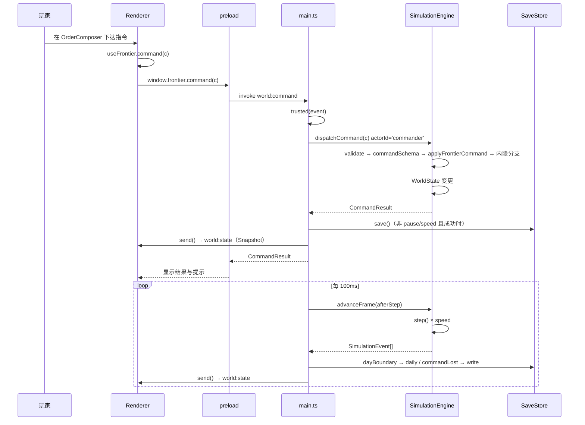

# Lv1/Lv2 运行时调用图（01-runtime-call-graph）

生成日期：2026-10-07
用途：Prompt 1 产物。回答「游戏从一次玩家命令到世界状态变化，究竟发生了什么」。

> 所有行号在写入前回原文核对。系统构成见 `01-lv1-lv2-architecture.md`；状态对应关系见 `01-state-and-command-map.md`。

---

## 第一部分：模拟循环（Runtime Loop）

### 1.1 宿主层

`electron/main.ts:165-196`：

```text
setInterval(() => {                                    main.ts:165
  const previousLog = engine.state.nextLog;
  let events = engine.advanceFrame((events, state) => {  main.ts:169
    if (events.some(e => e.type === 'dayBoundary'))  store.daily(state);   :170
    if (events.some(e => e.type === 'commandLost'))  store.write(state);   :171
  });
  // 异常 → 暂停 + 标记存档阻塞                                   :173-177
  if (engine.state.tick - lastAutoSave >= 100 ||          main.ts:180-184
      engine.state.nextLog !== previousLog ||
      events.some(e => e.type === 'criticalPause'))
    save();                                                // 同步落盘
  send();                                                  // 推送 Snapshot  :192
  const publicEvents = events.filter(e => e.type === 'shipTransited');  :193
  if (publicEvents.length) window.webContents.send('world:events', publicEvents);  :195
}, HOST_FRAME_MS);                                         // 100ms
```

**四条落盘触发条件**（互不排斥）：

| 触发 | 条件 | 位置 |
| --- | --- | --- |
| 日快照 | 本帧含 `dayBoundary` 事件 | `main.ts:170` → `SaveStore.daily` |
| 指挥权丢失 | 本帧含 `commandLost` | `main.ts:171` → `SaveStore.write` |
| 定期自动保存 | `tick - lastAutoSave >= 100`（= 10 游戏分钟） | `main.ts:180-181` |
| 有日志或重大暂停 | `nextLog` 变化，或含 `criticalPause` | `main.ts:182-183` |

**每帧都推送 Snapshot**（`main.ts:192`），与是否落盘无关。

### 1.2 帧层

`SimulationEngine.advanceFrame(afterStep?)`（`engine.ts:162-171`）：

```ts
const speed = this.state.speed;
for (let i = 0; i < speed && !this.state.paused; i++) {
  const next = this.step();
  afterStep?.(next, this.state);
  events.push(...next);
}
```

- 循环次数 = `state.speed`（1 / 4 / 16），**每步都是相同的 `FIXED_DELTA`**。
- `paused` 为真时立即停止——因此暂停发生在步与步之间，不会撕裂一步。

### 1.3 步层（唯一的模拟入口）

`SimulationEngine.step()`（`engine.ts:134-161`）完整顺序，含两种早退：

```text
step(fixedDelta = FIXED_DELTA)
├─ [守卫] fixedDelta !== FIXED_DELTA → throw               engine.ts:135
├─ [守卫] w.paused || isCommandLost() → return []          engine.ts:137
├─ w.tick++ ; w.time = w.tick / 10                         engine.ts:138-139
├─ gameCalendar(w.tick)               ※tick % 14400 === 0  engine.ts:140-143
│     → events.push({type:'dayBoundary'})
├─ w.beams = w.beams.filter(未过期)                          engine.ts:144
├─ updateSensors(this)                ※tick % 10 === 0      engine.ts:145
├─ [早退] pending 含 newContact                              engine.ts:146-147
│     → return [...events, ...pendingEvents, ...finishCritical()]
├─ advanceEconomy(this, dt)                                 engine.ts:148
├─ for s of [...w.ships]   advanceShip(this, s, dt)          engine.ts:149-152
├─ for s of [...w.enemies] advanceEnemy(this, s, dt)         engine.ts:153-156
├─ advanceTrade(this, dt)                                   engine.ts:157
├─ advanceFactions(this, dt)                                engine.ts:158
├─ advanceEvents(this, dt)                                  engine.ts:159
└─ return [...events, ...pendingEvents.splice(0), ...finishCritical()]
```

**三个必须知道的顺序事实**：

1. `updateSensors` 在**逐舰循环之前**，且每 10 tick 一次。情报先更新，舰船再行动。
2. `newContact` 会**短路整个 tick**——新接触时后续系统这一步完全不执行，`pendingEvents` 与 critical 立即返回。这是「发现新舰即暂停」的实现方式。
3. `[...w.ships]` 每步浅拷贝遍历，因此循环内增删舰船不会破坏迭代。

### 1.4 三处「决策门控」——同一模式的重复

物理行为每 tick 都算，**只有决策被门控**。这是 Lv3 调度器应当照搬的既有范式：

| 位置 | 门 | 周期 |
| --- | --- | --- |
| `updateSensors`（`sensors.ts:56`） | `w.tick % 10 === 0` | 每游戏分钟 |
| `advanceEvents` 的事件创建（`world-events.ts:113`） | `w.tick % 10 === 0` | 每游戏分钟 |
| `decideThreat`（`threats.ts:79-80`） | `if (w.time < s.nextDecision) return;` 然后 `s.nextDecision = w.time + RULES.decisionInterval` | `RULES.decisionInterval = 5` 游戏分钟 |

> **关键**：`decideThreat` 用**模拟时间 deadline** 表达「下次决策时刻」，而它本身是**同步、无 I/O** 的。这个结构可以直接被 Lv3 的调度器借用，但 Lv3 的**模型调用必须在 `step()` 之外**——见 `01-agent-gap-analysis.md` §3。

### 1.5 逐舰执行环

`advanceShip(e, s, dt)`（`execution.ts:140`）内部的固定顺序：

```text
advanceShip(e, s, dt)
├─ regenerate(s, w.time, dt)        :142   护盾/核心回复
├─ advanceStanding(e, s)            :143   Standing Orders 非交战自主行为
├─ [分支] s.emergencyRetreat         :144-150  紧急脱离优先于一切指令
├─ const d = s.current               :151
├─ [分支] !d → autonomousFire(e,s)   :152-155  无指令时执行 ROE 自动开火
├─ [分派] 按 d.action.type 进入 20+ 分支（表见 00-code-map.md §3）
└─ [收尾] 非交战指令后 autonomousFire :714-719
```

`advanceStanding`（`fleet.ts:49`）首行即 `if (hasAdmiralWork(s)) return;`（`:50`，`hasAdmiralWork` 判定 `source === 'admiral'`，`fleet.ts:39-41`）。

### 1.6 完成与续接

`engine.complete(s, text, failed)`（`engine.ts:108-133`）顺序：

1. `s.current = null`、`s.tracking = null`、`s.path = []`、`s.status = 'idle'`（`:109-113`）
2. 若原有指令，按 `action` / `actionFailed` 记入历史与通信（`:114-119`）
3. **取下一个**：`s.suspended.pop() ?? s.queue.shift()`（`:120`）——**挂起栈 LIFO 优先于队列 FIFO**
4. `validateContinuation`（`command-system.ts:309`）校验接续目标
   - 通过 → `s.current = next`，`note = '接续：' + text`（`:124-127`）
   - 失败 → **递归 `complete(..., true)`**，清掉后继续尝试（`:129-130`）

`validateContinuation` 对 `REARM` 有特例（`command-system.ts:309-317`）：若 `phase === 'rearming'`，用**剩余 `reserved` 数量**而非原始 `load` 重新校验，避免「已装一半」被误判为无法接续。

---

## 第二部分：玩家命令链（Command Chain）

### 2.1 端到端

```text
① UI 意图
   OrderComposer.tsx:613-616  │  Inspector.tsx:467  │  App.tsx:265-278
   ↓
② useFrontier.command(c)          src/ui/hooks/useFrontier.ts:21-36
   ↓ window.frontier.command(c)
③ preload contextBridge           electron/preload.ts:5 → ipcRenderer.invoke('world:command')
   ↓
④ main.ts:108  ipcMain.handle('world:command')
   ├─ trusted(event)              main.ts:109 → :91-98（校验发送方）
   ├─ SessionCommand?             main.ts:110-128（restorePreviousDay / beginNewFrontier）
   └─ engine.dispatchCommand(c)   main.ts:131   ← 注意：不传 actorId，默认 'commander'
   ↓
⑤ dispatchCommand                 command-system.ts:340-... （4 阶段，见 2.2）
   ↓
⑥ WorldState 变更                 engine.state
   ↓
⑦ 落盘                            main.ts:132-141（见 2.4）
   ↓
⑧ send() 推送 Snapshot            main.ts:142 → :23-25
```

**UI 侧的三个命令构造点**（全部经 `useFrontier.command`）：

| 位置 | 构造 |
| --- | --- |
| `OrderComposer.tsx:613-616` | `issueGroupDirective` 或 `issueDirective` |
| `Inspector.tsx:467` | `issueDirective` |
| `App.tsx:265-278` | 地图下达 `MOVE`（`issueGroupDirective` / `issueDirective`） |

`useFrontier.command`（`useFrontier.ts:21-36`）负责：调用 IPC、播音频、提示、成功后刷新 timeline、异常时提示「无法连接模拟引擎」。**它不做任何本地校验**——校验完全在引擎侧。

### 2.2 四阶段分派管线

`dispatchCommand(input, actorId = 'commander')`（`command-system.ts:340-350`）：

```text
阶段 1  this.validate(input, actorId)         :345
        └─ 失败 → 直接返回该 CommandResult     :346
阶段 2  commandSchema.parse(input)            :347   （重新解析；阶段 1 已 safeParse，此处不会抛）
阶段 3  applyFrontierCommand(this, c)         :349   ← 对「每一种」命令都调用
        └─ 返回非 null → 直接返回              :350   （非 frontier 类型返回 null，frontier-commands.ts:245）
阶段 4  inline if (c.type === ...) 链          :351-548
```

> 阶段 3 对**所有**命令类型调用是容易看漏的设计：`sellStock` 等 frontier 命令完全在阶段 3 处理完，阶段 4 里针对它们的代码是**不可达的**（`command-system.ts:296-297` 即一例死分支）。

### 2.3 校验的分层

`validate()`（`command-system.ts:149-306`）内部的**通用门**（对所有命令生效，先于任何类型分支）：

| 门 | 位置 | 说明 |
| --- | --- | --- |
| Schema | `:154-155` | `commandSchema.safeParse` |
| 世界状态 | `:158` | `w.status !== 'active'` → 拒绝（COMMAND LOST 时只能恢复或开新档） |
| **操作者权限** | `:159-167` | actor 必须是 `w.commander.id`；否则**只允许** `issueDirective` 且 `shipIds.length === 1` 且该舰分配给该 operator |

通过通用门后进入类型校验：`dismissMapMarker`（`:209-212`）→ **`validateFrontierCommand`（`:213-214`，若返回非 null 即结束）** → `cancelDirective`/`standingOrders` → `setCloak` → `renameEntity` → `startConstruction` → 基地门 → `buildShip`/`upgrade`/`manufacture` → … → **兜底 `return ok()`（`:306`）**，覆盖 `pause` 与 `speed`。

动作级校验在 `validateAction(e, s, a)`（`command-system.ts:34-148`），由 `issueDirective` 分支逐舰调用（`:177-178`）。

> ⚠️ **`electron/main.ts:131` 不传 `actorId`**，因此走 Renderer 的命令 actor 恒为 `'commander'`，操作者权限门 `:159-167` **总是通过**。这是正确的（Renderer 就是 Admiral），但意味着**该门只对 `submitAction` 路径有实际约束**。

### 2.4 落盘时机

`main.ts:132-141`：

```ts
if (result.ok &&
    typeof command === 'object' && command &&
    (engine.state.pauseReasons.length > previousReasons ||
     !['speed', 'pause'].includes(command.type))) {
  save();                               // 同步写盘
}
```

即：**除 `speed` 与 `pause` 外，每一条成功的命令都立即同步落盘**；另外「产生了新的 pauseReason」的命令也落盘（即使它是 pause/speed）。失败的命令不落盘。

### 2.5 快照回程

`send()`（`main.ts:23-25`）→ `engine.snapshot()`（`projection.ts:59-198`）→ `structuredClone` 白名单投影 → `webContents.send('world:state', ...)` → preload `onState`（`preload.ts:15-19`）→ `useFrontier` 的 `setWorld`（`useFrontier.ts:45`）。

`world:get`（`main.ts:99-107`）是同一个投影的按需版本，额外返回 `saveMessage` / `saveBlocked` / `timeline`。

---

## 第三部分：完整调用图


