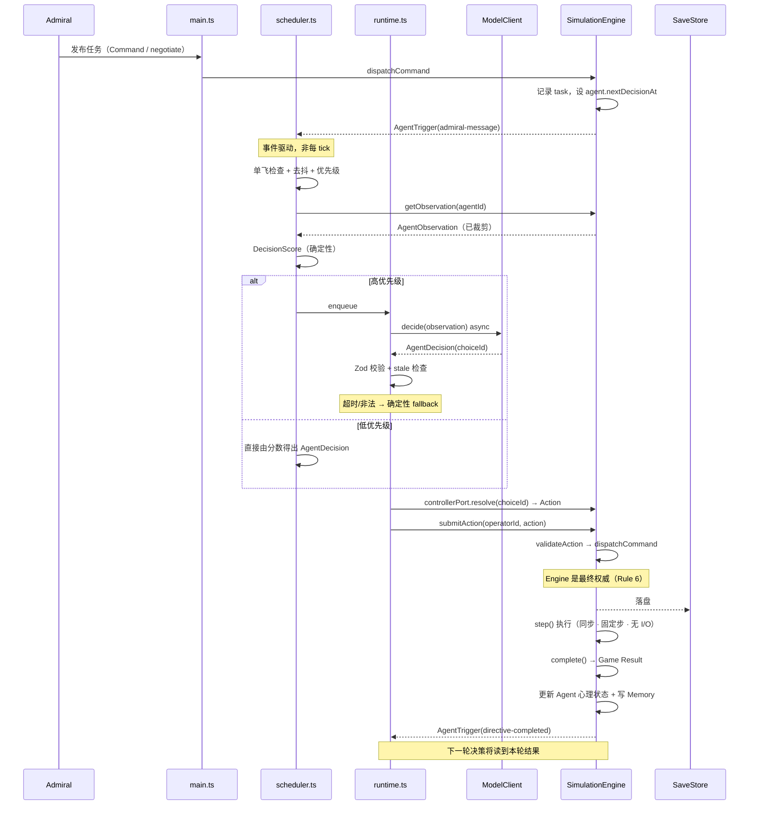

# Lv3 决策流与调度（02-decision-flow）

生成日期：2026-10-07
输入：`Agent.md`（§33/§34/§35/§46/§58）；`docs/lv3/01-mvp-scenario.md`；反构基线 `docs/lv3/01-runtime-call-graph.md`、`01-state-and-command-map.md`、`01-agent-gap-analysis.md`；事实来源为当前 `src/`、`electron/`、`tests/` 源码。
性质：合同文档。定义「谁决定什么」与「何时决定」。

> LLM 的输入输出契约详见 `02-llm-boundary.md`；领域结构见 `02-domain-model.md`。

---

## 1. 最小闭环

`docs/lv3/01-mvp-scenario.md` §1.3 与 `Agent.md` §51 定义的同一条链：

```text
① Admiral 发布任务          ← 既有 Command 或新增的 negotiate/ask 消息
        ↓
② Agent 观察任务            ← AgentObservation.availableActions
        ↓
③ Agent 依据自身决策         ← Personality + Goal + State + Memory + Relationship
        ↓
④ Accept / Reject / Counteroffer / Request
        ↓
⑤ 玩家响应                  ← ASK / NEGOTIATE / PROMISE / OVERRIDE
        ↓
⑥ 必要时 Agent-Agent Team-up ← 既有 ESCORT 指令
        ↓
⑦ SimulationEngine 执行任务  ← 既有 Action / validateAction / step()
        ↓
⑧ Game Result               ← 引擎结算，非 Agent 决定
        ↓
⑨ Goal / Relationship / Trust / Fatigue / Memory 更新
        ↓
⑩ 下一次决策受过去影响
```

**闭环成立与否的唯一判据**（`Agent.md` §50）：第 ⑩ 步必须能观察到第 ⑨ 步的效果。若 Memory 不影响未来行为，「Memory 系统没有实际意义」。

---

## 2. 三方职责划分

`Agent.md` §25/§26 的分工，落到具体实现：

| 环节 | 确定性规则 | LLM | SimulationEngine |
| --- | --- | --- | --- |
| 候选动作生成 | **✅** 由世界状态推导 `availableActions` | ❌ | ❌（只提供数据） |
| 决策分数 | **✅** `DecisionScore`（§4） | ❌ | ❌ |
| 意图表达 | ❌ | **✅** `intent` / `reason` / `say` | ❌ |
| 选项选择 | 低优先级时**✅** 按分数；高优先级时才用 LLM | **✅** `choiceId` | ❌ |
| 参数构造 | **✅** 由 `choiceId` 解析出 `Action` | ❌ **禁止** | ❌ |
| 合法性 | **✅** | ❌ | **✅** `validateAction` |
| 物理结算 | ❌ | ❌ | **✅** |
| 状态更新（物理） | ❌ | ❌ | **✅** |
| 状态更新（Agent 心理） | **✅** 由结算结果推导 | ❌ | ❌ |
| 记忆写入 | **✅** | ❌ | ❌ |

**一句话概括**（`Agent.md` §26）：

> LLM 决定「我想做什么」。Engine 决定「这个事情实际上能不能发生，以及发生后结果是什么」。

**关于心理状态为什么由确定性规则更新**：`Agent.md` §46 明确「LLM 不负责计算这个分数」。同理，Trust/Fatigue/Morale 的增减必须可复现、可测试——否则 `Agent.md` §59 的断言（Override → trust 变化）无法稳定通过。

---

## 3. 调度器（Scheduler）

### 3.1 硬约束

| 约束 | 来源 | 数值 |
| --- | --- | --- |
| 不得每 tick 调用 LLM | `Agent.md` §34，CLAUDE.md §2.4 | — |
| `step()` 保持同步、无 I/O | `engine.ts:134-161` | — |
| 16× 时每秒 160 步 | `advanceFrame` × `speed` | `clock.ts:6-7` |
| 同 seed 重放必须一致 | `tests/architecture.test.ts:39-60` | — |

### 3.2 触发模型：事件驱动 + 模拟时间节拍

两层防护，**都要有**：

**第一层——离散事件**（`AgentTrigger`，见 `02-domain-model.md` §14）。由引擎在既有分支中发出：

| 触发 | 发出点 |
| --- | --- |
| `directive-completed` / `directive-failed` | `engine.complete()`（`engine.ts:108-133`） |
| `ship-idle` | `advanceStanding` 末尾置 `idle` 时（`fleet.ts:148-152`） |
| `world-event` | `createEvent`（`world-events.ts:22`） |
| `danger` | `updateSensors` 产生新接触时（`sensors.ts:56`） |
| `admiral-message` | 新增的互动命令 |
| `promise-changed` | Promise 状态变更时 |

**第二层——模拟时间节拍**（兜底，防止「长期无决策」）：

照搬既有 `decideThreat` 的范式（`threats.ts:79-80`），但**实际模型调用在 `step()` 之外**：

```ts
// 概念示意，非最终代码
if (w.time >= agent.nextDecisionAt) { enqueueDecision(agent.id); }
agent.nextDecisionAt = w.time + RULES.agentDecisionInterval;   // 提案 15 游戏分钟
```

### 3.3 去抖与防重复

| 机制 | 规则 |
| --- | --- |
| 单飞 | 同一 `agentId` 同一时刻**至多一个** pending 决策 |
| 冷却 | 决策结束后设 `nextDecisionAt`，冷却期内不重触发 |
| 合并 | 冷却期内到达的多个触发合并为一个待处理标记 |
| 上限 | 每游戏分钟最多 N 次模型调用（提案 N=1），超出降级为确定性 |

**为什么需要单飞**：`Agent.md` §43 的 team-up 会产生「A 请求 B → 立即触发 B 决策 → B 回复又触发 A」的循环。单飞 + 冷却切断它。

### 3.4 优先级（`Agent.md` §35）

| 优先级 | 触发 | 处置 |
| --- | --- | --- |
| 高 | 新合约、高冲突任务、反报价、重大事件、承诺破裂、Agent 冲突、外部邀请、退出决策、最终关键决策 | **走 LLM** |
| 低 | 移动、等待、常规资源扣减、常规维修、已知低风险动作 | **确定性规则**，不调 LLM |

**这条是 MVP 成本控制的关键**：`Agent.md` §35 明确「低优先级事件使用确定性规则即可」。因此一个正常推进的游戏里，绝大多数 tick **没有任何模型调用**。

### 3.5 失败与降级（`Agent.md` §58）

| 失败 | 处置 |
| --- | --- |
| 超时 | 丢弃，用确定性 fallback；写一条 `provider` 轨迹 |
| JSON 非法 | 丢弃，fallback |
| `choiceId` 不在 `availableActions` 中 | 拒绝，fallback（Rule 3） |
| API 错误 | 丢弃，fallback；连续失败则暂停该 Agent 的 LLM 路径若干分钟 |
| Observation 过期（`observationTick` 落后过多） | **丢弃**，不 fallback——世界已变，旧决策无意义 |

**fallback 阈值**（`Agent.md` §46 / §58）：

```text
score >= 70   → ACCEPT
45 - 69       → 需要 LLM；LLM 不可用则安全默认 = wait
25 - 44       → REQUEST / COUNTER
< 25          → REJECT
```

> `45-69` 落在「安全默认 = wait」是刻意的：这一档正是**需要判断力**的区间，用确定性规则硬猜会产生错误的行为。保持原地等待是唯一不会造成伤害的选择。

### 3.6 确定性 fallback 不是可选项

没有 fallback 就无法满足 `tests/architecture.test.ts:39-60` 的重放断言，也无法在无网络环境下跑 `Agent.md` §59 的全部测试。**fallback 与 LLM 路径必须产生同一种 `AgentDecision` 结构**，仅 `provider` 字段不同。

---

## 4. `DecisionScore`（确定性决策分）

`Agent.md` §46 的公式，各项**输入来源**落到既有代码：

```text
DecisionScore =
    0.20 SkillFit
  + 0.20 GoalAlignment
  + 0.15 RewardAttractiveness
  + 0.10 CEOTrust
  + 0.10 TeamFit
  + 0.10 CareerValue
  + 0.05 PromiseValue
  - 0.10 RiskDiscomfort
  - 0.10 FatiguePenalty
```

| 项 | 输入 | 来源 |
| --- | --- | --- |
| `SkillFit` | 候选的 `goalKinds` 与 `career` 的匹配度 | `AgentActionCandidate` + `Agent.career` |
| `GoalAlignment` | 候选 `goalKinds` ∩ `goal.kind` | `02-domain-model.md` §4 |
| `RewardAttractiveness` | 候选的 `reward` | `AgentActionCandidate.reward` |
| `CEOTrust` | `state.trustInAdmiral` | Agent 状态 |
| `TeamFit` | 相关 `AgentRelationship.value` | 关系表 |
| `CareerValue` | 候选与 `career` 的长期增益 | 提案：与 `SkillFit` 同源但看长期 |
| `PromiseValue` | 是否存在 pending promise 且与此候选相关 | `AgentPromise.fulfills` |
| `RiskDiscomfort` | 候选 `risk` × (100 − `personality.riskTolerance`) | 人格 |
| `FatiguePenalty` | `state.fatigue` 分档（§21） | 状态 |

**`RecentMemoryScore`**：`Agent.md` §46 的公式**未列**此项，但 §50 要求记忆影响未来行为。**提案追加**一项 `+0.15 RecentMemoryScore`，由匹配 `tags` 的记忆按 `weight` 加权得出——否则 §50 的闭环在公式层就断了。

> 权重的绝对值需在 Prompt 4 用实际决策结果校准。此处只固定**结构**与**输入来源**。

---

## 5. 状态更新规则（结算后）

由 `engine.complete()` 的结果驱动（`engine.ts:108-133`）：

| 事件 | 更新 |
| --- | --- |
| 任务成功 | `goalProgress += Δ`（§48）、`experience += Δ`、`fatigue += 10`（§21 普通任务） |
| 高风险任务成功 | `fatigue += 15`（§21） |
| 任务失败 | `morale -= Δ`、`stress += Δ`、`fatigue += 15` |
| 休息 | `fatigue -= 20`（§21） |
| Promise fulfilled | `trust ↑`、`loyalty ↑`、`morale ↑`、`goalProgress ↑`（§19） |
| Promise broken | `trust ↓`、`loyalty ↓`、`stress ↑`（§19） |
| Override | `trust -= 10`、`morale -= 5`、`stress += 10`（§42） |
| Team-up 成功 | 双方 `relationship.value ↑`、`cooperation ↑`（§13） |

**Fatigue 分档**（`Agent.md` §21）：`0-39` 正常 / `40-69` 疲劳 / `70-84` 严重疲劳 / `85-100` 强制休息。

**每次更新都写入 `AgentInteraction.effects`**，使 §59 的断言有对象可查。

---

## 6. 完整时序


