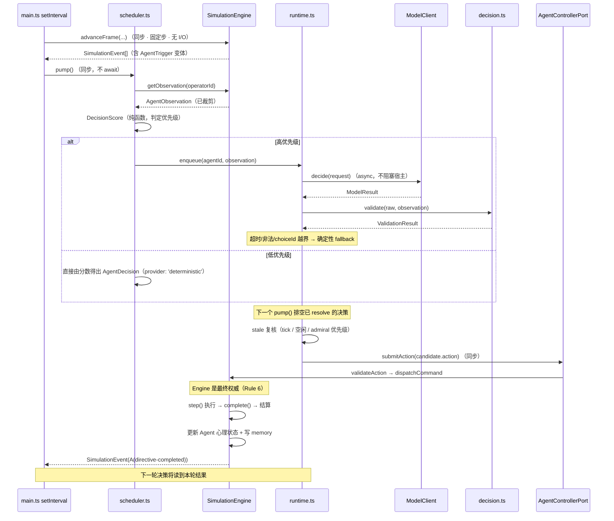

# Lv3 模块间 API 契约（03-api-contract）

生成日期：2026-10-08
阶段：Prompt 3（Implementation Plan + Codex Handoff）
性质：**代码模块之间如何调用**的合同。**不是**业务 Schema 的重新定义——业务字段以 `schemas/*.json`
与 `docs/lv3/02-domain-model.md` 为准，本文件只回答「谁调用谁、传什么、同步还是异步、失败怎么办、
谁有权改状态」。

> 依赖：`02-llm-boundary.md` §3/§5/§6（`ModelClient` 与失败处理）、`02-decision-flow.md` §2/§3
> （三方职责与调度）、`03-implementation-plan.md` §4（本阶段定稿的决策）、`KNOWN_ISSUES.md`。

---

## 1. 状态变更权限（最重要的一张表）

| 组件 | 可否改 `WorldState` | 手段 | 依据 |
| --- | --- | --- | --- |
| `SimulationEngine` | ✅ **唯一权威** | 内部方法 + `dispatchCommand` | CLAUDE.md §2.1 |
| `src/engine/agent/**`（纯领域） | ❌ | 只做纯计算，输入输出都是值 | Rule 1 |
| `electron/agent/**`（runtime / scheduler / provider） | ❌ | **只持有 `AgentControllerPort`**，不持有 `SimulationEngine` 引用 | Rule 1 / `02-llm-boundary.md` §2 |
| LLM（DeepSeek 等） | ❌ | 只输出结构化 `AgentDecision`（含 `choiceId`） | Rule 2/3 |
| Renderer | ❌ | 只读 `Snapshot`，写只经既有 IPC 命令 | `AGENTS.md` 引擎边界 |
| `SaveStore` | ❌（不直接改） | 只序列化引擎给它的 `WorldState` | 既有设计 |

**架构兜底（比「约定」更强的保证）**：`applyFrontierCommand` 只有 `command-system.ts:349` 一个调用点，
`dispatchCommand` 是唯一变更入口。**只要 Agent 层拿不到 `SimulationEngine` 实例，上述禁止就无法被违反。**

---

## 2. 唯一允许的管线

```text
AgentObservation                      ← 已裁剪，不含 WorldState
        ↓
Prompt（带 promptVersion）             ← prompt.ts
        ↓
LLM                                   ← ModelClient.decide()，async
        ↓
Structured AgentDecision              ← 结构化 JSON，非自由文本
        ↓
Zod Schema Validation                 ← 结构合法性
        ↓
choiceId resolution                   ← Agent 层：availableActions.find(...)
        ↓
ControllerPort.submitAction()         ← engine.ts:91-96（既有接缝）
        ↓
Game Rule Validation                  ← 既有 validateAction → validate
        ↓
SimulationEngine                      ← 最终权威
```

**七个环节缺一不可。** `choiceId resolution` **不能**被省略成「LLM 直接给 Action」——那正是参数幻觉的来源。

---

## 3. 决策结果的三个路由分支

`AgentDecision.intent` 决定后续走哪条路（`02-*` 未明说，本阶段定稿）。

```text
intent === 'act'
   → choiceId 必须在 availableActions 中
   → 取出 candidate.action（已构造好的既有 Action）
   → ControllerPort.submitAction(action)
   → 引擎 validateAction → dispatchCommand

intent === 'request' | 'invite'
   → 产生 AgentMessage（Agent → Admiral 或 Agent → Agent）
   → 若构成互动则写 AgentInteraction
   → 绝不调用 submitAction

intent === 'wait' | 'respond' | 'rest' | 'quit'
   → 产生 AgentMessage（可空文本）/ 状态增量
   → 绝不调用 submitAction
```

> 例外：`team-accept:<agentId>` 是**社交决策**（不解析为 Action），但接受后由 runtime
> **另起一次** `act` 决策提交既有 `ESCORT`（`types.ts:233`）。两条路径分开，避免「社交选择」与
> 「物理动作」混在同一个 decision 里。

---

## 4. 接口契约

### 4.1 `AgentControllerPort`（既有，**不加宽 key**）

| 项 | 内容 |
| --- | --- |
| **实现方** | `SimulationEngine.controllerPort(operatorId)`（`engine.ts:91-96`，`Object.freeze`） |
| **调用方** | `electron/agent/runtime.ts` |
| **Input** | `operatorId: string`（构造时绑定） |
| **Output** | `AgentControllerPort`，其 key 集合**恰好** `['getObservation','submitAction']` |
| **同步/异步** | 两个方法皆**同步** |
| **失败模式** | `getObservation()` 在无绑定或 operator 无 Agent 时返回 `null`；`submitAction()` 返回 `CommandResult { ok: false, reason }`（**不抛异常**） |
| **验证边界** | `submitAction` 内部走 `actionSchema.safeParse` + 既有 `validate` 权限门 |
| **变更权限** | 只有 `submitAction` 能改状态，且仅限**本舰** |

```ts
export interface AgentControllerPort {
  getObservation(): AgentObservation | null;
  submitAction(action: Action): CommandResult;
}
```

**硬约束**：`tests/architecture.test.ts:13` 断言 `Object.keys(port).sort()` 恰为这两个 key。
**禁止**新增第三个方法（例如 `resolve(choiceId)`）——见 `KNOWN_ISSUES.md` `C-11`。

**返回类型加宽说明**：`getObservation()` 的返回类型由 `Observation` 加宽为 `AgentObservation`
（`03-implementation-plan.md` §4.3）。这是**类型加宽**，key 集合与方法签名不变。

### 4.2 `ObservationProvider`

| 项 | 内容 |
| --- | --- |
| **实现方** | `projection.getObservation`（`projection.ts:199-228`）绑定到引擎；装配逻辑抽出到 `src/engine/agent/observation.ts` |
| **调用方** | `Scheduler`（取决策上下文）；`Runtime`（stale 检测比对） |
| **Input** | `operatorId: string` |
| **Output** | `AgentObservation \| null` |
| **同步/异步** | **同步** |
| **失败模式** | 无 Agent ⇒ `null`（调用方必须处理，不得当空状态继续） |
| **验证边界** | 无（只读投影） |
| **变更权限** | **无**——纯读；返回值经 `structuredClone` 与 `ReadonlyDeep` |

**裁剪义务（Rule 5）**：`AgentObservation` **不得**包含：其他 Agent 的 memory/promise/state、
`WorldState.enemies`、`seed`/`initialSeed`、`factions` 内部（reports/credits/stance）、他人舰船货舱与弹仓、
未发现的地理。既有 `snapshot()` 已完成全部世界级裁剪，`observation.ts` 在其上**只加一层「单 Agent 视角」过滤**。

**新增泄漏向量（必须测）**：memory 的 `text`。写记忆时不得嵌入未发现实体的名称，
否则 `tests/recon.test.ts:365` 的隐私断言会失败。

### 4.3 `DecisionEngine`（`score.ts` + `decision.ts`）

| 项 | 内容 |
| --- | --- |
| **实现方** | `src/engine/agent/score.ts`（`DecisionScore`）、`src/engine/agent/decision.ts`（构造/校验/fallback） |
| **调用方** | `Scheduler`、`Runtime` |
| **Input** | `AgentObservation` + `Agent`（人格/状态/目标/关系/记忆） |
| **Output** | `{ score: number; fallback: AgentDecision }` |
| **同步/异步** | **同步、纯函数** |
| **失败模式** | 无（纯计算，不抛） |
| **验证边界** | 无（分数不是合法性判据） |
| **变更权限** | **无** |

**硬约束**：**LLM 不计算此分数**（`Agent.md` §46）。分数只用于①优先级判定（是否值得走 LLM）
②LLM 不可用时的确定性 fallback。

### 4.4 `ModelClient`

| 项 | 内容 |
| --- | --- |
| **实现方** | `electron/agent/mock-client.ts`（fixture）、`electron/agent/openai-compatible.ts`（DeepSeek 等） |
| **调用方** | `Runtime` |
| **Input** | `DecisionRequest` |
| **Output** | `Promise<ModelResult>` |
| **同步/异步** | **异步**（唯一允许 async 的环节） |
| **失败模式** | **不抛异常**，一律返回 `{ ok: false, error: ModelError }` |
| **验证边界** | 只做 JSON 解析 + `AgentDecision` Zod 校验 + `choiceId` 归属校验；**不做**游戏规则校验 |
| **变更权限** | **无**——拿不到 `SimulationEngine` |

```ts
interface ModelClient {
  readonly id: string;              // 'deepseek' | 'mock' | ...
  readonly promptVersion: string;
  decide(request: DecisionRequest): Promise<ModelResult>;
}

interface DecisionRequest {
  observation: AgentObservation;    // 已裁剪
  systemPrompt: string;
  decisionPrompt: string;
  schema: JsonSchema;
  timeoutMs: number;
}

type ModelResult =
  | { ok: true;  decision: AgentDecision; latencyMs: number }
  | { ok: false; error: ModelError;      latencyMs: number };

type ModelError =
  | 'timeout' | 'http-error' | 'invalid-json'
  | 'schema-mismatch' | 'invalid-choice-id' | 'unavailable';
```

**provider 无关性**：领域层只依赖接口，不依赖任何 provider（`Agent.md` §32）。
**mock provider 必须长期存在**：全部离线回归测试依赖它（`02-llm-boundary.md` §3）。

### 4.5 `DecisionValidator`

| 项 | 内容 |
| --- | --- |
| **实现方** | `src/engine/agent/decision.ts`（**纯函数，无 I/O**，因此可离线单测） |
| **调用方** | `Runtime`（在 provider 返回之后、提交动作之前） |
| **Input** | `unknown`（provider 原始输出）+ `AgentObservation` |
| **Output** | `ValidationResult = { ok: true; decision: AgentDecision } \| { ok: false; error: ModelError }` |
| **同步/异步** | **同步** |
| **失败模式** | 返回错误码，**不抛** |
| **验证边界** | ① JSON 可解析 ② 通过 `AgentDecision` Zod ③ `intent === 'act'` 时 `choiceId` ∈ `availableActions` 的 id 集合 ④ `observationTick` 未过期 |
| **变更权限** | **无**——它只校验，不执行 |

**两条硬约束**：

- `choiceId` 越界 ⇒ 返回 `invalid-choice-id`，**绝不**回退为「让模型直接给 Action」（Rule 3）。
- **游戏规则校验不属于本接口**——那是既有 `validateAction` 的职责（`command-system.ts:34`）。
  本接口只保证「结构合法 + 选自已给出的选项」。

### 4.6 `Scheduler`

| 项 | 内容 |
| --- | --- |
| **实现方** | `electron/agent/scheduler.ts` |
| **调用方** | `electron/main.ts`（宿主循环，`main.ts:165-196`） |
| **Input** | `pump()` 无参；内部读 `engine.state.time` 与 `engine.state.ships`；另接收 `SimulationEvent[]` 中的 `AgentTrigger` 变体 |
| **Output** | 无（副作用：填/排空内部的 `Map<agentId, Pending>`，并触发 `Runtime`） |
| **同步/异步** | `pump()` **同步返回**；它**发起**异步请求但**不等待** |
| **失败模式** | 内部 `try/catch` 兜底；provider 异常只记日志，**不得**影响 `saveBlocked`（`N-9`） |
| **验证边界** | 无（不校验决策内容） |
| **变更权限** | **无**——只改自己的队列，绝不触碰 `WorldState` |

**职责边界**：判定「**何时**该决策」（去抖、单飞、优先级、上限），**不做**决策本身，**不知道** Agent 语义。

**硬约束**：

| 约束 | 依据 |
| --- | --- |
| 不得每 tick 调用 LLM | `Agent.md` §34；CLAUDE.md §2.4 |
| `step()` 保持同步、无 I/O | `engine.ts:134-161` |
| `pump()` 不得 `await` | 否则阻塞 `setInterval` |
| 决策节拍按**帧**判定，不放进 step 循环 | `advanceFrame` 每帧跑 `state.speed`（1/4/16）次 step |
| 指令存续检测：`ship.current` 消失且无完成事件 ⇒ 合成 `directive-failed` | `KNOWN_ISSUES.md` `C-17` |

### 4.7 `AgentRuntime`

| 项 | 内容 |
| --- | --- |
| **实现方** | `electron/agent/runtime.ts` |
| **调用方** | `Scheduler` |
| **Input** | `agentId` + `AgentTrigger`（可选） |
| **Output** | `void`（副作用：可能提交一条命令） |
| **同步/异步** | 内部**异步**（`await client.decide`），由 Scheduler 以 `Promise` 保存，**不被宿主 await** |
| **失败模式** | 全部失败路径 ⇒ 丢弃 + 记一条 `provider` 轨迹；除「provider 自报的 tick 与所发观测不符」（错误串 `'stale'`）外走确定性 fallback。**真正的过期丢弃在 `Scheduler`，不在本模块**（`KNOWN_ISSUES.md` `C-37`） |
| **验证边界** | 调 `DecisionValidator`；提交前做 stale 复核 |
| **变更权限** | 仅经 `ControllerPort.submitAction` |

**stale 复核（提交前必须再查一次，判定在 `Scheduler`——它才持有世界）**：若以下任一成立则**丢弃**：`state.tick - observationTick` 超阈、
舰船不再空闲、出现 `source: 'admiral'` 的指令、已被更新的决策取代。

### 4.8 `PersistenceAdapter`（既有 `SaveStore`，不改签名）

| 项 | 内容 |
| --- | --- |
| **实现方** | `electron/persistence.ts` 的 `SaveStore` |
| **调用方** | `electron/main.ts`（自动存档、日快照、失败封存）、`restorePreviousDay` / `beginNew` |
| **Input** | `WorldState`（`write` / `daily`） |
| **Output** | `{ ok, reason }` / `LoadedWorld` / `TimelineStatus` |
| **同步/异步** | **同步**（`writeFileSync` + `renameSync` 原子写） |
| **失败模式** | `blocked` 状态抛错；超 32MB 抛错；`worldSchema.parse` 失败抛错 |
| **验证边界** | 写入前 `worldSchema.parse`——**Agent 数据必须能过 v11 schema** |
| **变更权限** | 不改变状态，只持久化 |

**Lv3 影响**：根目录/索引名、`indexSchema` 版本、`migrateTimeline` 的链式迁移（详见 `03-implementation-plan.md` §7.4）。
**不做的事**：不新建第二套持久化；不修改 `legacy-v9/`；不把 Agent 状态存到 `localStorage` 或独立文件。

---

## 5. 调用时序（一次完整决策）



---

## 6. 契约的失败语义汇总

| 接口 | 失败时的行为 | 是否 fallback |
| --- | --- | --- |
| `ModelClient.decide` | 返回 `{ ok: false, error }` | — |
| `DecisionValidator.validate` | 返回 `{ ok: false, error }` | — |
| `AgentRuntime`（超时 / 非法 JSON / schema 不符 / choiceId 越界 / HTTP 错误 / provider 不可用） | 丢弃 | ✅ 确定性 fallback |
| `Scheduler`（**Observation 过期**） | 丢弃 | ❌ **不 fallback**——基于旧观测的分数同样是错的。判定在 `Scheduler`（`C-37`）：`AgentRuntime` 不持有世界，测不出时间 |
| `AgentRuntime`（**指令被引擎侧清除**） | 合成 `directive-failed` + morale/stress 更新 | — |
| `AgentControllerPort.submitAction` | 返回 `{ ok: false, reason }` | 记 `provider` 轨迹后丢弃；下次基于**新**观测重试 |

**退避**：有限重试（最多 2 次）+ 指数退避，之后降级为确定性模式一段时间（提案 30 游戏分钟）。
**不无限重试**——`Agent.md` §58 只要求「不能导致游戏崩溃」。

---

## 7. 确定性契约（不虚假宣称）

| 模式 | 可重放 | 用途 |
| --- | --- | --- |
| Engine 重放（同 seed 同命令） | ✅ **是** | `tests/architecture.test.ts:39-60`，必须保持 |
| `mock` provider + 录制决策 | ✅ **是** | 全部回归测试 |
| Live LLM | ❌ **否** | 人工演示，**不参与回归断言** |

**不得声称**「同样输入 LLM 必得同样输出」。

---

## 8. IPC 边界

**Lv3 不新增任何 IPC 通道，也不让 Renderer 直连 provider。**

| 项 | 现状 |
| --- | --- |
| 通道数 | 7：`world:get`、`world:command`、`world:save`、`world:timeline`、`display:zoom`、`world:state`（推送）、`world:events`（推送） |
| 密钥 | **仅主进程**，从环境变量读取；不进仓库、不进 Renderer、不进日志 |
| `ModelClient` 实例 | `electron/agent/`（Renderer 是 `sandbox` + `contextIsolation`，`main.ts:71-77`） |
| 网络调用 | 主进程（唯一有 Node 权限的进程） |
| 日志 | 仅记 `agentId` / `decisionTime` / `promptVersion` / `status` / `latency` |

**Agent 决策全部在主进程内完成**，Renderer 仍只经既有 `Snapshot` 显示结果。
Agent 的对外发言**同时**写一条既有 `Communication`，使既有 UI 通信流**零改动**即可显示（`N-6`）。
