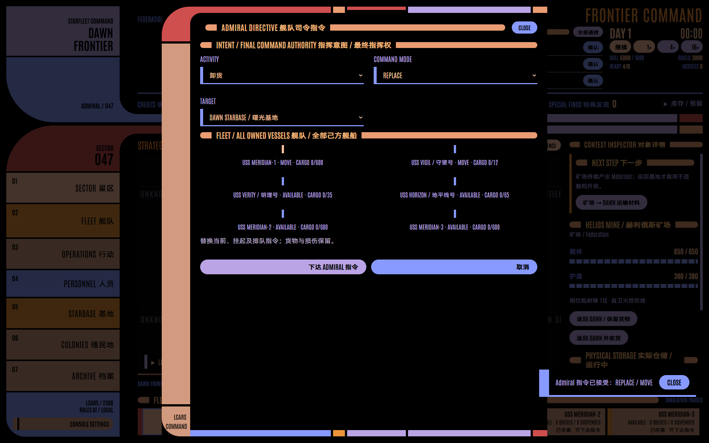
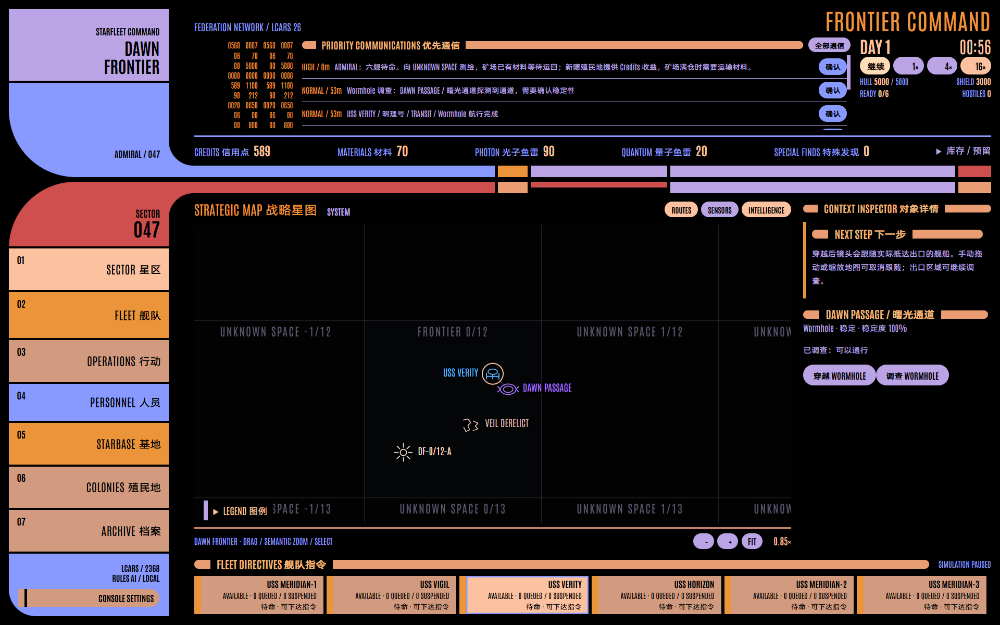
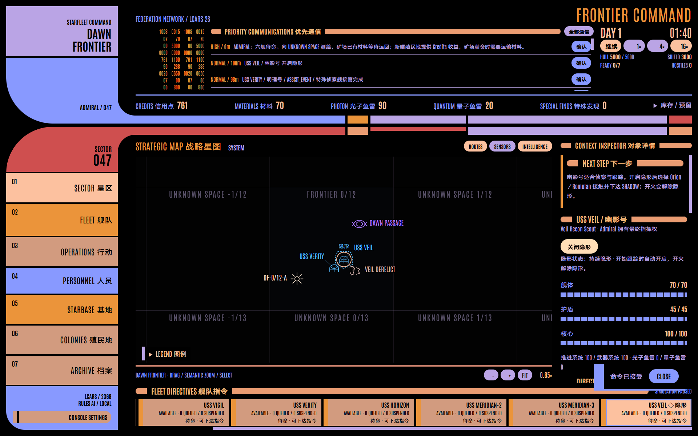
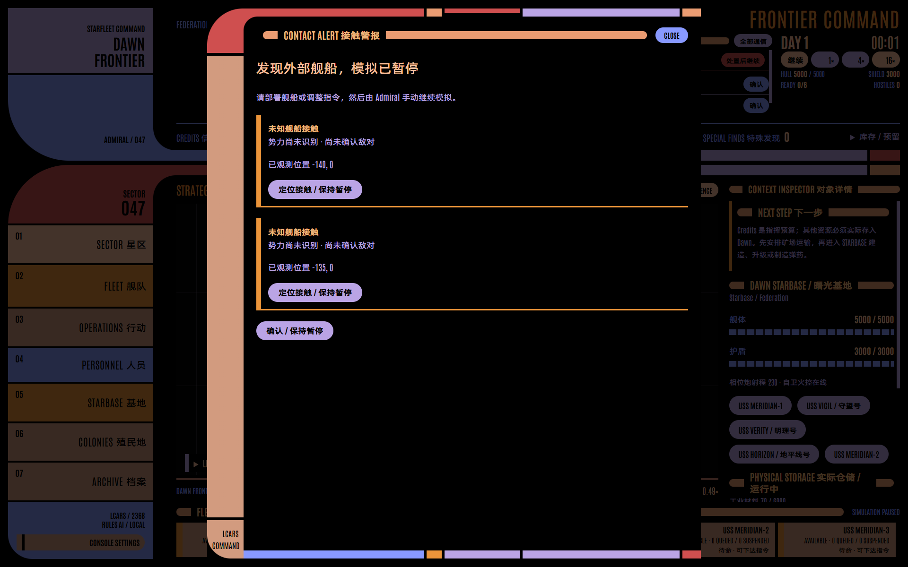
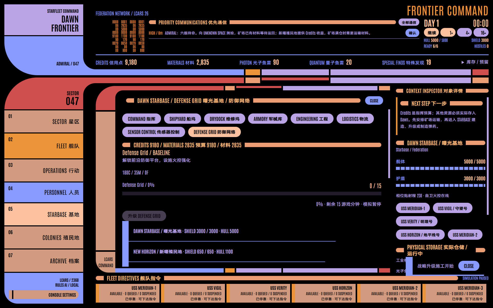
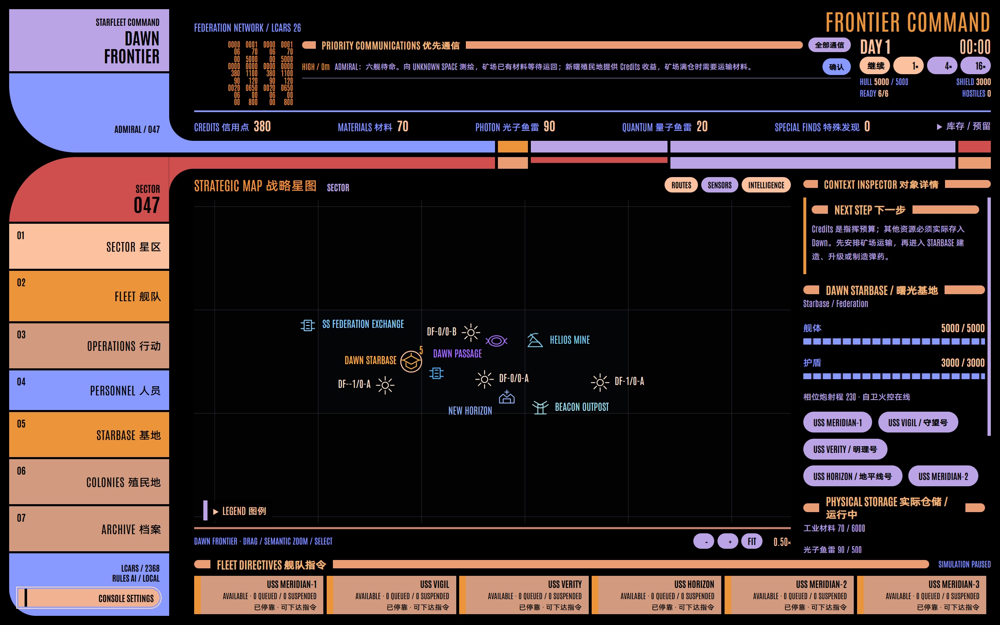
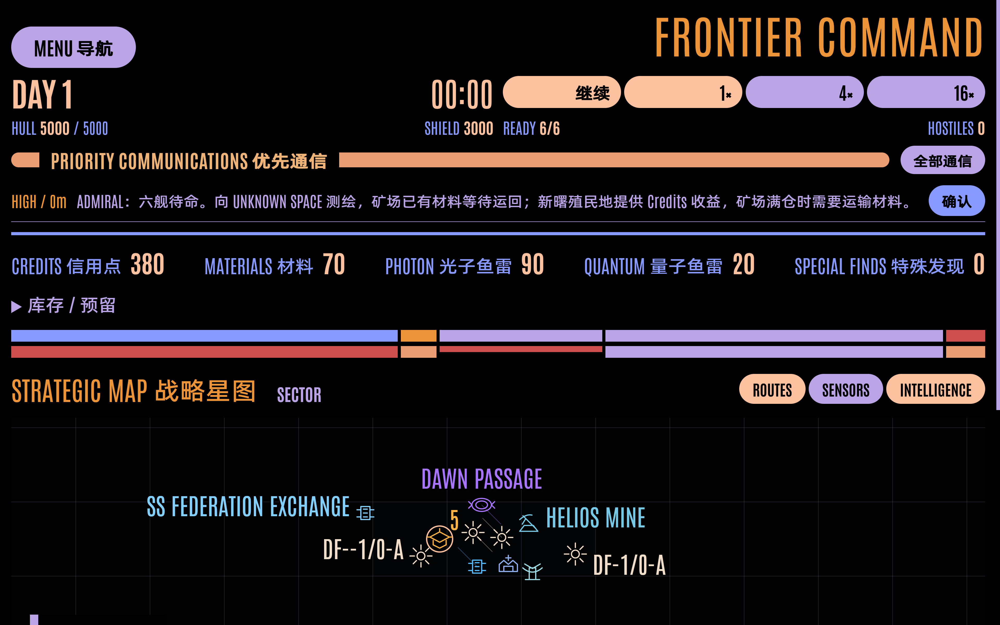

# Frontier Command / v9 验证记录

验证日期：2026-10-06。基线为本地提交 `49f5660`，保持主进程引擎、固定步、现有指令、事件和 LCARS 26 Classic 架构。新建严格 v9 世界；原 v8 世界文件没有读取、迁移或修改。所有检查的汇总见 [验收结果](verification/v9/checks-summary.json)。

| 检查                                | 结果与证据                                                                                                                                                                |
| ----------------------------------- | ------------------------------------------------------------------------------------------------------------------------------------------------------------------------- |
| `npm test`                          | 11 文件、159 项通过；[机器结果](verification/v9/unit-last-run.json)                                                                                                       |
| `npm run build`                     | 严格 TypeScript、Vite Renderer、Electron 主进程生产编译通过；[构建输出](verification/v9/build-last-run.txt)                                                               |
| 完整 Electron E2E                   | 30 项通过，无失败、跳过或重试；[机器结果](verification/v9/electron-last-run.json)                                                                                         |
| 正常新世界、可见 Electron、离线字体 | seed 236807 通过；[真实实玩记录](verification/v9/acceptance-236807.json)                                                                                                  |
| 原生显示缩放与文字/界面放大         | 125% / 150% / 200%，文字 100% / 150% / 200%；[125%](verification/v9/display-125.json)、[150%](verification/v9/display-150.json)、[200%](verification/v9/display-200.json) |

## 航线、连续选舰和物流

安全航线在没有已观测危险时只包含目的点。规则测试验证已知异常/新鲜敌对接触避让、探索顺序和隐藏敌方状态不参与规划，保存的路径只包含坐标。找不到安全候选路径时，预估与执行明确报告风险。

真实 Electron 中先选舰、Ctrl 多选，再选矿场仍保留全部选舰；运输和其他任务继承选择。临时多舰 MOVE 复用现有批量指令，不建立正式编队。正式编队、REPLACE / QUEUE / INTERRUPT 另有原有回归。已装载 Materials 的 RETURN 保留货物，UNLOAD 到 `base` 才实际入库，相关规则同时验证物资与预留守恒。

实际 Wormhole 穿越后，主进程仅推送己方舰船 ID、实际出口和 tick。镜头在真实出口跟随，重新点击正在跟随的舰船保留跟随，选残骸结束；管理窗口和正在编辑的指令不因展示事件被关闭。批量穿越优先保留主选舰的跟随。

## 接管指引、隐形和地图清理

SURVEY 近距完成的同一步立即建立现有失落舰船事件，详情提供“派舰现场接管”。真实 UI 完成 SURVEY → ASSIST_EVENT，获得唯一 USS VEIL；残骸不再展示建设表单。上下文提示覆盖探索、调查、建设材料缺口、矿场满仓、货物入库、升级和 SHADOW，只读取公开 Snapshot。

己方隐形状态在地图轮廓、虚线环、文字和底部舰船条显示。已接管幽影残骸可右键移除；200% 文字下菜单测量和钳制在真实窗口内，并支持 Escape。引擎拒绝仍有货物、奖励、现场事件或打捞指令的标记清理，保存真实实体/稳定 ID/历史。实际保存重启验证已移除标记和隐形状态。

普通 Orion/Romulan 跟踪仍需真实传感器观测，会积累暴露并被假航点甩尾。Veil 隐形尾随到实际目的地，先显示疑似设施，再持续侦察十游戏分钟确认。未知基地、AI intent、真目的地、假航点及私有暴露证据不进入公开输出。秘密尾随的 Electron 测试由实际按钮下令和确认警报；测试通过独立存档判定私有甩尾状态，没有 Renderer 测试修改入口。

## 接触警报与真实进度

规则测试验证首次外部接触、十分钟失联重获、首次敌对升级、持续观测去重以及 1× / 4× / 16× 在同一 tick 暂停。接触去重记录只在主进程/严格存档，公共 Snapshot 不含该记录。观察发生的 tick 立即暂停，倍率循环不会继续跑后续步。

真实 Electron 同一步的两个接触合并为一个 LCARS 弹窗、一个现有警报音；显示尚未确认敌对的身份。定位、确认与下达 MOVE 后 tick 仍不前进，只有 Admiral 手动继续才恢复。声音遵循音量和静音偏好。

五项战略升级按钮旁的百分比、进度条和剩余游戏分钟来自真实工作量，暂停明确标注，施工按钮禁用，完成后 ONLINE；真实 UI 在管理页保持打开时验证进度增加与完成。造舰、制造和改装使用同一进度组件及其引擎工作数值，原经济/工业回归验证执行结算。

## 可读性与字体

时钟下方始终显示 Credits、Materials、Photon、Quantum、Special Finds，实物可用量扣除执行/暂停指令预留，零库存不隐藏。每档显示缩放、每档文字大小都实际检查五项子元素在资源条内，资源条与地图不重叠。放大内容通过折行、滚动、展开导航和 Inspector 抽屉适配。

正文根字号实测为 18 / 27 / 36px，界面使用 rem/em。文字比例与 Electron 界面缩放分别保存；实际把界面缩放到 200%，仍能操作设置，并以 Ctrl+0 回到 100%，文字比例保持不变。所有六个管理页和八个 Starbase 模块逐一检查放大后的入口与标题边界，标题起始色条在圆角遮罩外，左右纯色且无异色边框。

中文继续使用基于提供的普惠体 Medium 校准的独立正文/粗体资产，英文数字使用 Antonio Regular/Bold；原始字体完整保留，本轮不更换或伪造字体。断网后通过 Chromium 平台字体接口确认四套对应字体。100px 参考字号下，中英字面上下边界差不超过 2px，横竖笔画粗细差均不超过 10%，关闭浏览器伪粗体；三档实测见上方 display JSON 和 [字体说明](../fonts/README.md)。

标签只在标记附近避让，连线接文字框最近边缘且不超过当前字号 4em；不足时省略名称或隐藏低优先级文字，全名由悬浮/详情提供。三层地图继续使用现有稀疏生成和统一语义 palette。

## 正常新世界和保留规则

`node scripts/acceptance-v9.mjs 236807` 启动可见生产 Electron，保留全部正常持久敌舰与设施，不注入库存，不直接推进时钟。只通过真实按钮/表单和生产 Command：Vigil 完成 MOVE 后连续一游戏小时原地待命，Verity 穿越固定通道，调查并接管幽影号，在详情开启隐形，最终保存且无页面错误。初始 Mine Materials 容量确认 3000，v9 Snapshot 与舰籍完整记录于 JSON。

原有简化经济、Colony Credits、Materials 守恒、3000 满仓/报告/运输恢复、默认舰船不自主返航、紧急本地脱离、唯一幽影/永久舰损、多 seed 稀疏生成、每日快照和事务分支恢复继续由完整规则测试覆盖。新私有接触记录与公开标记状态进入严格 v9 schema；拒绝 v8 及更早世界。

历史 v8 证据保留于 `verification/v8/`。本轮交付源码和生产构建，不推送远程、不重打安装包、不接入 LLM。启动当前实现使用 `npm start`。
